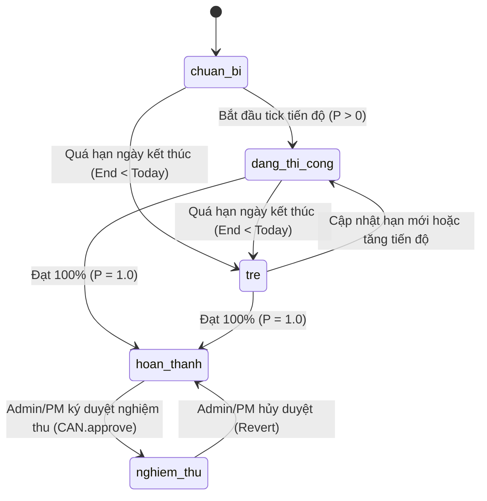

# USER ERROR HEALING MASTER — QUY CHUẨN TỰ CHỮA LÀNH LỖI NGƯỜI DÙNG ĐẲNG CẤP THƯỢNG THỪA (PINNACLE ASCENSION)

Bộ Skill này đóng gói toàn bộ tri thức, giải thuật tối ưu và nguyên tắc phòng vệ tối thượng nhằm **phát hiện sớm, tự động chỉnh đốn, phân giải mờ nghĩa, phục hồi dữ liệu hỏng và chữa lành hoàn hảo mọi sai sót, nhầm lẫn từ phía người dùng** trên toàn bộ hệ sinh thái XBoss.

---

## 1. BẢY TRỤ CỘT TỰ CHỮA LÀNH TỰ TRỊ (THE 7 PILLARS)

1. **Bảo toàn Ý định Gốc & Zero Data Loss (Intent Preservation):**
   - Không bao giờ âm thầm loại bỏ dữ liệu thô của người dùng. Luôn lưu bản chụp gốc `raw_payload` trước khi qua bộ lọc.

2. **Bậc Thang Tự Chữa Lành 4 Cấp Độ (4-Tier Hierarchy):**
   - **L1 — Tự Sửa Trong Suốt:** Ký tự tàng hình (`\u200B`, `\u00A0`), font cũ TCVN3/VNI, số tiền lẫn chữ, ngày tháng hỗn hợp/Excel serial, chuẩn hóa mã BOQ.
   - **L2 — Khớp Mờ & Gợi Ý 1-Chạm:** Độ tương đồng $\ge 80\%$ cho tiếng lóng công trường, lỗi chính tả, danh mục vật tư.
   - **L3 — Hướng Dẫn Tương Tác & Lựa Chọn Thông Minh:** Tự động phát hiện logic bất hợp lý (ngày kết thúc < bắt đầu, vượt định mức), mở giao diện câu hỏi trực quan.
   - **L4 — Ngắt Mạch Khẩn Cấp & Cách Ly An Toàn:** Chặn đứng vi phạm quy chuẩn pháp lý/kỹ thuật (bỏ qua Hold-Point, hạ cấp nghiệm thu).

3. **Lũy Đẳng Tuyệt Đối & Chống Đúp Thao Tác (Idempotency):**
   - Mọi request đều được bảo vệ bằng `Idempotency-Key` hoặc hash SHA-256 nội dung, đảm bảo $f(f(x)) = f(x)$.

4. **Hợp Nhất Trường Độc Lập Chống Xung Đột (Field-Level CRDT & 3-Way Merge):**
   - Hợp nhất dữ liệu đa người dùng và ngoại tuyến PWA theo từng trường riêng biệt, không ghi đè mất mát dữ liệu của nhau.

5. **Tự Tái Thiết Ma Trận WBS & Sửa Lỗi Công Thức Excel Hỏng (`#REF!`, `#VALUE!`, `#DIV/0!`):**
   - Tự động nhận diện cấu trúc phân cấp Gói thầu $\rightarrow$ Task $\rightarrow$ Dimension và phục hồi các ô công thức bị gãy bằng quy luật tổng cân bằng.

6. **Phát Hiện Bất Thường Số Liệu Thời Gian Thực (Statistical $Z\text{-Score}$ Outlier Detection):**
   - Phân tích độ lệch chuẩn so với dữ liệu lịch sử để cảnh báo ngay lập tức khi kỹ sư nhập số liệu bất thường (gõ thừa số 0).

7. **Lá Chắn Giới Hạn Phạm Vi Tác Động & Du Hành Thời Gian (Blast-Radius Shield & Time-Travel Undo):**
   - Tự động tạo bản chụp thời gian (Time-Travel Snapshot) trước mọi thao tác hàng loạt, cho phép hoàn tác 1-chạm trong vòng 24 giờ.

---

## 2. QUY TRÌNH 5 BƯỚC CHỮA LÀNH LỖI THƯỢNG THỪA

```
[B1: Ingest & Quarantine] ──► [B2: Chẩn đoán Căn nguyên] ──► [B3: Động cơ Chữa lành Đa miền] ──► [B4: Xác minh Toàn vẹn] ──► [B5: Phản hồi Thấu cảm UX]
```

### Bước 1: Tiếp nhận, Cách ly An toàn & Lưu Giữ Ý định (Ingest & Quarantine)

- Đóng gói toàn bộ payload thô, headers, mốc thời gian và danh tính người dùng vào snapshot an toàn.

### Bước 2: Chẩn đoán Căn nguyên & Đo Lường Độ Lệch Chuẩn (Diagnostic & Z-Score)

- Phân tích cú pháp, ngữ nghĩa, logic WBS và tính toán chỉ số bất thường $Z\text{-Score}$.

### Bước 3: Động cơ Tự Chữa Lành Đa Miền (Domain-Specific Healing Engine)

- Áp dụng các công thức chuyên sâu từ 7 bộ cẩm nang tham chiếu:
  - **Bảng tính & Import:** [references/excel-data-healing-recipes.md](file:///c:/Users/liend/xboss/.agents/skills/user-error-healing-master/references/excel-data-healing-recipes.md)
  - **Công thức & Ma trận:** [references/excel-formula-and-matrix-healing.md](file:///c:/Users/liend/xboss/.agents/skills/user-error-healing-master/references/excel-formula-and-matrix-healing.md)
  - **Khẩu lệnh & So khớp mờ:** [references/nlp-fuzzy-intent-recipes.md](file:///c:/Users/liend/xboss/.agents/skills/user-error-healing-master/references/nlp-fuzzy-intent-recipes.md)
  - **Ý định Sâu & Bất thường AI:** [references/anomaly-detection-and-intent-ai.md](file:///c:/Users/liend/xboss/.agents/skills/user-error-healing-master/references/anomaly-detection-and-intent-ai.md)
  - **Trạng thái & Tiến độ:** [references/state-machine-repair-recipes.md](file:///c:/Users/liend/xboss/.agents/skills/user-error-healing-master/references/state-machine-repair-recipes.md)
  - **Xung đột & Đồng bộ:** [references/conflict-resolution-crdt-recipes.md](file:///c:/Users/liend/xboss/.agents/skills/user-error-healing-master/references/conflict-resolution-crdt-recipes.md)
  - **Phòng vệ & Hoàn tác:** [references/blast-radius-time-travel-undo.md](file:///c:/Users/liend/xboss/.agents/skills/user-error-healing-master/references/blast-radius-time-travel-undo.md)

### Bước 4: Xác minh Toàn vẹn & Khóa Bất biến (Integrity & Invariant Verification)

- Đảm bảo dữ liệu không có giá trị rác, tiến độ $[0, 1]$, số tiền chuẩn xác từng xu (BigInt), ngày bắt đầu $\le$ ngày kết thúc.

### Bước 5: Phản hồi Trực quan & Trải Nghiệm Thấu Cảm (Empathetic UX & One-Click Resolution)

- Cung cấp thông báo 3 phần rõ ràng, nhân văn kèm các nút hành động 1-chạm (Xem trước, Xác nhận, Hoàn tác).

---

## 3. TÀI LIỆU THAM CHIẾU KỸ THUẬT (REFERENCES)

- [references/excel-data-healing-recipes.md](file:///c:/Users/liend/xboss/.agents/skills/user-error-healing-master/references/excel-data-healing-recipes.md): Xử lý 10 dị tật bảng tính Excel/CSV.
- [references/excel-formula-and-matrix-healing.md](file:///c:/Users/liend/xboss/.agents/skills/user-error-healing-master/references/excel-formula-and-matrix-healing.md): Phục hồi công thức gãy `#REF!` và tái dựng ma trận WBS.
- [references/nlp-fuzzy-intent-recipes.md](file:///c:/Users/liend/xboss/.agents/skills/user-error-healing-master/references/nlp-fuzzy-intent-recipes.md): So khớp mờ và từ điển tiếng lóng công trường.
- [references/anomaly-detection-and-intent-ai.md](file:///c:/Users/liend/xboss/.agents/skills/user-error-healing-master/references/anomaly-detection-and-intent-ai.md): Thuật toán $Z\text{-Score}$ và bóc tách khẩu lệnh ngữ cảnh sâu.
- [references/state-machine-repair-recipes.md](file:///c:/Users/liend/xboss/.agents/skills/user-error-healing-master/references/state-machine-repair-recipes.md): Tự cân đối trạng thái tiến độ WBS và nghiệm thu 2 bước.
- [references/conflict-resolution-crdt-recipes.md](file:///c:/Users/liend/xboss/.agents/skills/user-error-healing-master/references/conflict-resolution-crdt-recipes.md): Phân giải xung đột 3-way merge và đồng bộ ngoại tuyến PWA.
- [references/blast-radius-time-travel-undo.md](file:///c:/Users/liend/xboss/.agents/skills/user-error-healing-master/references/blast-radius-time-travel-undo.md): Bản chụp thời gian Time-Travel và lá chắn phạm vi tác động.

---

## 4. CÔNG CỤ THỰC THI (SCRIPTS)

- [scripts/user_error_healer.ts](file:///c:/Users/liend/xboss/.agents/skills/user-error-healing-master/scripts/user_error_healer.ts): Bộ kịch bản CLI kiểm chứng toàn bộ 15 ca kiểm thử tự chữa lành đẳng cấp Thượng Thừa.

---

## 4. TẬP HỢP CẨM NANG & QUY CHUẨN THAM CHIẾU KỸ THUẬT CHI TIẾT (CONSOLIDATED TECHNICAL REFERENCE COMPENDIUM)

### 4.1. [Cẩm nang kỹ thuật] anomaly-detection-and-intent-ai

# CẨM NANG PHÁT HIỆN BẤT THƯỜNG THỐNG KÊ & GIẢI MÃ Ý ĐỊNH SÂU (ANOMALY DETECTION & DEEP INTENT AI)

Tài liệu này cung cấp công thức phát hiện bất thường số liệu theo thuật toán $Z\text{-Score}$ và giải thuật phân tích ngữ cảnh sâu cho khẩu lệnh công trường.

---

## 1. THUẬT TOÁN PHÁT HIỆN BẤT THƯỜNG DỮ LIỆU $Z\text{-SCORE}$

Khi kỹ sư hiện trường nhập khối lượng nghiệm thu hoặc tiêu hao vật tư:

1. **Thu thập Tập mẫu Lịch sử:** $X = \{x_1, x_2, \dots, x_n\}$ (ví dụ: khối lượng ống nước các tầng 2..9).
2. **Tính Trung bình Mẫu:**
   $$\mu = \frac{1}{n} \sum_{i=1}^{n} x_i$$
3. **Tính Độ lệch Chuẩn:**
   $$\sigma = \sqrt{\frac{1}{n} \sum_{i=1}^{n} (x_i - \mu)^2}$$
4. **Tính Chỉ số Độ lệch $Z\text{-Score}$ của Giá trị Nhập Mới $x_{\text{new}}$:**
   $$Z = \frac{|x_{\text{new}} - \mu|}{\sigma}$$

### Thang Cảnh Báo Thông Minh

- $Z < 2.0$: Bình thường (Không hiển thị cảnh báo).
- $2.0 \le Z < 3.5$: **Cảnh báo Nhẹ (Warning)** — "Khối lượng $x_{\text{new}}$ cao hơn $40\%$ so với mức trung bình các tầng trước (${}\mu{}$). Bạn có chắc chắn không?"
- $Z \ge 3.5$: **Bất thường Cực lớn (Critical Anomaly)** — "Phát hiện giá trị $x_{\text{new}}$ cao gấp $5$ lần mức bình quân! Hệ thống nghi ngờ bạn gõ thừa số 0. Đề xuất giá trị hợp lý: $\text{Median}(X)$."

---

## 2. GIẢI MÃ NGỮ CẢNH ĐA THỰC THỂ CHO KHẨU LỆNH CÔNG TRƯỜNG

Khẩu lệnh phức tạp: _"Sáng nay Zone 1 tầng 10 hoàn thành ống thoát nước rồi, chuyển thợ anh Tâm qua tầng 11 làm tiếp"_.

Quy trình bóc tách:

1. **Slot Extraction:**
   - Tầng hiện tại: $T10$, Zone: $Zone 1$.
   - Tầng tiếp theo: $T11$.
   - Hành động 1: `update_progress` (hoàn thành).
   - Hành động 2: `assign_worker` (chuyển thợ).
2. **Contextual Entity Linking:**
   - So khớp $T10 + Zone 1 + \text{"ống thoát nước"}$ với danh sách task đang mở trong CSDL $\rightarrow$ Tìm ra chính xác Task ID `TASK-P-UPVC-10-Z1`.
   - So khớp $\text{"anh Tâm"}$ với danh sách tài khoản nhà thầu phụ trong CSDL $\rightarrow$ Tìm ra User ID `USR-MINH-TAM`.
3. **Automated Batch Action Generation:**
   - Giao dịch 1: Cập nhật $100\%$ cho Task `TASK-P-UPVC-10-Z1`.
   - Giao dịch 2: Gán `USR-MINH-TAM` vào Task `TASK-P-UPVC-11-Z1`.

---

### 4.2. [Cẩm nang kỹ thuật] blast-radius-time-travel-undo

# CẨM NANG PHÒNG VỆ PHẠM VI TÁC ĐỘNG & BẢN CHỤP DU HÀNH THỜI GIAN (BLAST-RADIUS & TIME-TRAVEL UNDO)

Tài liệu này cung cấp kiến trúc và giải pháp kỹ thuật bảo vệ hệ thống trước các thao tác phá hoại hoặc sai sót diện rộng của người dùng.

---

## 1. NGUYÊN TẮC LÁ CHẮN PHẠM VI TÁC ĐỘNG (BLAST-RADIUS SHIELD)

Khi người dùng thực hiện các thao tác có khả năng gây ảnh hưởng diện rộng:

- **Thao tác 1:** Xóa hàng loạt $\ge 10$ công việc hoặc 1 Gói thầu lớn.
- **Thao tác 2:** Cập nhật hàng loạt (Bulk Update) ngày bắt đầu/kết thúc làm biến động đường găng CPM.
- **Thao tác 3:** Import đè file Excel mới vào dự án đang thi công.

Hệ thống BẮT BUỘC thực hiện chuỗi phòng vệ 3 bước:

1. **Kiểm tra Ngưỡng Nguy hiểm (Impact Threshold Check):** Đo lường số lượng bản ghi bị ảnh hưởng $(\Delta N)$ và giá trị tiền tệ biến động $(\Delta M)$.
2. **Kích hoạt Bản chụp Thời gian (Time-Travel Snapshot):** Đóng gói toàn bộ trạng thái trước khi sửa kèm mã băm SHA-256 vào bảng `system_snapshots`.
3. **Cửa sổ Hoàn tác Tức thời 24 Giờ (24h Instant Rollback Window):** Cung cấp nút **"Hoàn tác thao tác này (Undo)"** trên giao diện Toast thông báo và trang quản trị.

---

## 2. CẤU TRÚC ĐÓNG GÓI SNAPSHOT AN TOÀN

```typescript
export interface TimeTravelSnapshot<T> {
  snapshotId: string; // vd: SNAP-1724131200000-a1b2c3d4
  entityType: string; // 'tasks_bulk_update' | 'boq_import' | 'work_package_delete'
  entityId: string; // ID hoặc Scope của nhóm thực thể
  timestamp: string; // ISO 8601
  payloadHash: string; // SHA-256 Hash toàn bộ payload
  data: T; // Dữ liệu phục hồi nguyên trạng
}
```

---

### 4.3. [Cẩm nang kỹ thuật] conflict-resolution-crdt-recipes

# CẨM NANG HỢP NHẤT XUNG ĐỘT TRƯỜNG ĐỘC LẬP & NGOẠI TUYẾN (CONFLICT RESOLUTION CRDT RECIPES)

Tài liệu này cung cấp giải thuật hợp nhất 3 chiều (3-Way Merge), cơ chế giải quyết xung đột cấp độ trường (Field-Level CRDT) và kỹ thuật chống trùng lặp thao tác mạng ngoại tuyến trong XBoss.

---

## 1. MÔ HÌNH HỢP NHẤT DỮ LIỆU 3 CHIỀU (3-WAY MERGE ARCHITECTURE)

Khi đồng bộ giữa **Cơ sở dữ liệu XBoss**, **Google Sheets**, và **Thiết bị Di động Ngoại tuyến (PWA Offline Queue)**:

```
          [Base Snapshot (Trạng thái chung ban đầu)]
                       /               \
                      /                 \
                     ▼                   ▼
    [Current Database State]        [Incoming State (Mobile / Sheet)]
                     \                   /
                      \                 /
                       ▼               ▼
           [Field-Level 3-Way Merge Resolver]
                           │
                           ▼
              [Merged Consistent State]
```

---

## 2. MA TRẬN PHÂN GIẢI XUNG ĐỘT CẤP ĐỘ TRƯỜNG (FIELD-LEVEL MATRIX)

| Tình Huống                      | Base Value   | Current DB   | Incoming     | Kết Quả Hợp Nhất                       | Ghi Chú Giải Thích                                               |
| :------------------------------ | :----------- | :----------- | :----------- | :------------------------------------- | :--------------------------------------------------------------- |
| **1. Chỉ Incoming Đổi**         | $A$          | $A$          | $B$          | **$B$**                                | Áp dụng incoming mượt mà không có xung đột.                      |
| **2. Chỉ Current Đổi**          | $A$          | $B$          | $A$          | **$B$**                                | Giữ current DB, incoming không thay đổi gì.                      |
| **3. Cả Hai Đổi Giống Nhau**    | $A$          | $B$          | $B$          | **$B$**                                | Cả hai cùng cập nhật cùng một giá trị.                           |
| **4. Xung Đột Trường Độc Lập**  | $(A_1, A_2)$ | $(B_1, A_2)$ | $(A_1, B_2)$ | **$(B_1, B_2)$**                       | User 1 sửa Field 1, User 2 sửa Field 2 $\rightarrow$ Giữ cả hai! |
| **5. Xung Đột Cùng Một Trường** | $A$          | $B_1$        | $B_2$        | **DB Ưu tiên hoặc Giá trị Không rỗng** | Ghi nhận conflict audit trail.                                   |

---

## 3. GIẢI THUẬT LŨY ĐẲNG & CHỐNG ĐÚP THAO TÁC (IDEMPOTENCY)

1. **Khóa Lũy Đẳng (Idempotency-Key Header):**
   - Mỗi request thay đổi trạng thái sinh UUIDv4 hoặc hash SHA-256 từ payload:
     $$\text{Request-Key} = \text{SHA256}(UserID + Action + TargetID + TimestampWindow_{5s})$$
   - Lưu vào bảng bộ nhớ đệm `idempotency_keys` với thời gian sống TTL = 10 phút.
   - Nếu phát hiện key đã được xử lý trong vòng 5 giây trước $\rightarrow$ Trả về ngay kết quả đã lưu trong cache, không chạy lại query DB.

2. **Hàng Đợi Ngoại Tuyến PWA (IndexedDB Replay):**
   - Khi mất mạng: thao tác tick tiến độ ghi vào IndexedDB.
   - Khi có mạng: Service Worker gửi tuần tự theo cơ chế FIFO.
   - Nếu server trả về 409 Conflict hoặc 422: Hệ thống chạy hàm `fieldLevel3WayMerge()` để cứu vãn các trường hợp lệ thay vì hủy toàn bộ gói dữ liệu.

---

### 4.4. [Cẩm nang kỹ thuật] excel-data-healing-recipes

# CẨM NANG TỰ CHỮA LÀNH DỮ LIỆU BẢNG TÍNH & EXCEL/CSV (EXCEL DATA HEALING RECIPES)

Tài liệu này cung cấp các giải thuật và quy trình xử lý triệt để 10 loại dị tật bảng tính kinh điển trong ngành xây dựng khi người dùng tải file Excel/CSV lên XBoss.

---

## 1. MƯỜI DỊ TẬT EXCEL KINH ĐIỂN & GIẢI PHÁP TỰ CHỮA LÀNH

### Dị tật 1: Header Bị Xê Dịch Hoặc Chìm Dưới Dòng Tiêu Đề Dự Án

- **Hiện tượng:** File Excel có 3-5 dòng đầu là logo, tên dự án, tên chủ đầu tư, hoặc dòng trống; dòng tiêu đề cột (Header) nằm ở dòng thứ 6.
- **Giải thuật Tự chữa lành:**
  1. Quét 15 dòng đầu tiên của bảng tính.
  2. Đếm số lượng từ khóa tiêu chuẩn khớp với từ điển (`mã`, `tên`, `đơn vị`, `khối lượng`, `đơn giá`, `bắt đầu`, `kết thúc`).
  3. Dòng nào có số lượng từ khóa khớp cao nhất ($\ge 3$ cột) được tự động chọn làm Dòng Header. Mọi dòng phía trên được đưa vào `metadata.project_header`.

### Dị tật 2: Ô Gộp Ngang/Dọc (Merged Cells)

- **Hiện tượng:** Cột Tên hệ thống hoặc Gói thầu được gộp ô trải dài 20 dòng. Khi đọc thô, chỉ dòng đầu tiên có giá trị, 19 dòng sau bị `null`/rỗng.
- **Giải thuật Tự chữa lành (Forward Fill / Unmerge Propagation):**
  1. Duy trì con trỏ ngữ cảnh `current_group_context`.
  2. Khi gặp ô rỗng ở cột phân cấp WBS, tự động kế thừa giá trị không rỗng gần nhất ở phía trên.

### Dị tật 3: Ngày Tháng Dạng Hỗn Hợp (Hybrid Dates)

- **Hiện tượng:** Một cột ngày chứa đồng thời:
  - Số nguyên Excel Serial (`46254`)
  - Định dạng Việt Nam `20/08/2026`
  - Định dạng ISO `2026-08-20`
  - Định dạng có dấu chấm `20.08.2026`
  - Định dạng ngắn `20/8/26`
- **Giải thuật Tự chữa lành:**
  - Áp dụng hàm `healDateString()`:
    - Nếu là số nguyên $10000 \le N \le 100000 \rightarrow$ Tính $Epoch_{\text{1899-12-30}} + N \times 86400000\text{ms}$.
    - Nếu chứa `/` hoặc `.` hoặc `-` $\rightarrow$ Tách Regex, tự động phân giải $DD$ vs $MM$ (nếu một phần tử $> 12 \rightarrow$ phần tử đó là $DD$).
    - Chuẩn hóa đầu ra về chuỗi ISO `YYYY-MM-DD`.

### Dị tật 4: Số Tiền & Khối Lượng Viết Lẫn Ký Tự

- **Hiện tượng:** `"12.500.000 đ"`, `"12,500,000 VND"`, `"12.5 triệu"`, `"1.2 tỷ"`, `"- 500.000"`, `"12,5 m2"`.
- **Giải thuật Tự chữa lành:**
  - Áp dụng `healMoneyValue()`:
    - Phát hiện các từ khóa cấp số nhân: `triệu/tr` ($\times 10^6$), `tỷ/ty` ($\times 10^9$), `k/nghìn` ($\times 10^3$).
    - Tự động nhận diện dấu phân tách thập phân vs phân tách hàng nghìn dựa trên vị trí dấu chấm và dấu phẩy cuối cùng.
    - Lưu trữ giá trị BigInt tính theo đơn vị nhỏ (đồng $\times 100$) để ngăn ngừa sai số số thực dấu phẩy động (Floating point error).

### Dị tật 5: Lỗi Bảng Mã Tiếng Việt Cũ (TCVN3 / VNI-Windows)

- **Hiện tượng:** Bản vẽ CAD hoặc file Excel dự toán cũ xuất chữ dạng `B¶ng tiÕn ®é` (TCVN3) hoặc `Baûng tieán ñoä` (VNI).
- **Giải thuật Tự chữa lành:**
  - Sử dụng bảng tra ánh xạ 1-1 `TCVN3_TO_UNICODE_MAP` và `VNI_TO_UNICODE_MAP` kết hợp chuẩn hóa NFC Unicode.

### Dị tật 6: Ký Tự Rác Tàng Hình & Khoảng Trắng Lạ

- **Hiện tượng:** Người dùng copy từ bảng biểu trên Web hoặc PDF dính ký tự Zero-width space (`\u200B`), Non-breaking space (`\u00A0`), Byte order mark (`\uFEFF`) làm hỏng hàm so sánh chuỗi.
- **Giải thuật Tự chữa lành:**
  - Regex loại bỏ: `replace(/[\u200B\u200C\u200D\uFEFF]/g, "").replace(/\u00A0/g, " ")`.

### Dị tật 7: Mã Hiệu BOQ Viết Tự Do

- **Hiện tượng:** `a1,01`, `A1-01`, `a1_01`, `A1 . 01`, `a1 01`.
- **Giải thuật Tự chữa lành:**
  - Chuyển `toUpperCase()`, thay toàn bộ khoảng trắng, dấu phẩy, gạch dưới bằng dấu chấm đơn: `A1.01`.

### Dị tật 8: Dòng Trùng Lặp (Duplicate Rows)

- **Hiện tượng:** Người dùng copy paste thừa nhiều dòng công việc có cùng mã BOQ và nội dung.
- **Giải thuật Tự chữa lành:**
  - Nhóm theo Khóa tự nhiên `(boq_code, sheet_slug)`.
  - Giữ lại dòng có đầy đủ thông tin nhất (nhiều trường có giá trị nhất), ghi nhận cảnh báo dedup trong log import.

### Dị tật 9: Cột Tên Header Đặt Tự Do Không Theo Mẫu

- **Hiện tượng:** Cột tên công việc được đặt là `Hạng mục thi công`, `Diễn giải công tác`, `Nội dung`, `Tên CV`.
- **Giải thuật Tự chữa lành:**
  - Sử dụng Ma trận Từ đồng nghĩa `DEFAULT_EXCEL_HEADER_SYNONYMS` kết hợp thuật toán tính độ tương đồng Jaro-Winkler để tự động map vào trường chuẩn `task_name`.

### Dị tật 10: Tỷ Lệ Tiến Độ Nhập Đa Dạng (0..1 vs 0..100)

- **Hiện tượng:** Dòng thì nhập `0.85`, dòng thì nhập `85` hoặc `85%`.
- **Giải thuật Tự chữa lành:**
  - Nếu giá trị $> 1.0$ và $\le 100 \rightarrow$ Tự động chia cho 100 để đưa về chuẩn $0.85$.
  - Nếu $> 100 \rightarrow$ Cảnh báo và giới hạn trần $1.0$ ($100\%$).

---

### 4.5. [Cẩm nang kỹ thuật] excel-formula-and-matrix-healing

# CẨM NANG PHỤC HỒI CÔNG THỨC EXCEL & TÁI CẤU TRÚC MA TRẬN PHÂN CẤP (FORMULA & MATRIX HEALING)

Tài liệu này hướng dẫn giải thuật tự động tái cấu trúc bảng tính đa tầng và phục hồi các ô công thức bị gãy `#REF!`, `#VALUE!`, `#DIV/0!` trong XBoss.

---

## 1. GIẢI THUẬT PHỤC HỒI CÔNG THỨC GÃY (FORMULA HEALING ENGINE)

Khi import bảng tính dự toán hoặc bảng theo dõi tiến độ, người dùng thường làm gãy liên kết công thức do:

- Xóa dòng/cột tham chiếu dẫn đến `#REF!`.
- Tính toán trên ô chứa chuỗi ký tự dẫn đến `#VALUE!`.
- Chia cho ô rỗng hoặc bằng 0 dẫn đến `#DIV/0!`.

### Quy Trình Suy Luận Cân Bằng Hàng/Cột (Row/Column Balance Invariant)

```
[Phát hiện #REF! / #VALUE!] ──► [Thu thập các Ô Thành phần (Siblings)] ──► [Xác định Loại Công thức] ──► [Tái sinh Giá trị Phục hồi]
```

1. **Công thức Tổng (`SUM`):**
   $$Value_{\text{healed}} = \sum_{i=1}^{k} \text{Siblings}_i$$
2. **Công thức Bình Quân (`AVERAGE`):**
   $$Value_{\text{healed}} = \frac{1}{k} \sum_{i=1}^{k} \text{Siblings}_i$$
3. **Công thức Tích (`MULTIPLY` — Khối lượng $\times$ Đơn giá):**
   $$TotalCost_{\text{healed}} = Quantity \times UnitPrice$$

---

## 2. GIẢI THUẬT TÁI CẤU TRÚC MA TRẬN PHÂN CẤP WBS (HIERARCHY RECONSTRUCTION)

Bảng tính xây dựng Việt Nam thường không có cột `parent_id` mà chỉ phân cấp bằng định dạng thị giác (Font bôi đậm, mã nhóm `A1`, sub-tasks `A1.01`, `A1.02`).

### Thuật Toán State-Machine Matrix Parser

1. Quét từng dòng từ trên xuống dưới.
2. Nếu mã hiệu không chứa dấu chấm (`A1`, `A2`, `M1`) và không có khối lượng $\rightarrow$ Đặt làm `currentGroup`.
3. Mọi dòng tiếp theo có mã hiệu dạng `A1.xx` $\rightarrow$ Tự động gán vào mảng con `currentGroup.tasks`.
4. Nếu gặp mã nhóm mới (`A2`) $\rightarrow$ Đóng nhóm `A1` và mở nhóm `A2`.
5. Nếu file hoàn toàn không có mã nhóm $\rightarrow$ Tự động bọc vào nhóm ảo `GENERAL ("Hạng mục chung")`.

---

### 4.6. [Cẩm nang kỹ thuật] nlp-fuzzy-intent-recipes

# CẨM NANG SO KHỚP MỜ & GIẢI MÃ KHẨU LỆNH HIỆN TRƯỜNG (NLP FUZZY INTENT RECIPES)

Tài liệu này cung cấp các giải thuật xử lý ngôn ngữ tự nhiên (NLP), so khớp mờ (Fuzzy Matching) và trích xuất ý định (Intent & Slot Filling) đối với tin nhắn, giọng nói hoặc khẩu lệnh từ kỹ sư công trường qua Zalo, Telegram hoặc thanh tìm kiếm XBoss.

---

## 1. TỪ ĐIỂN TIẾNG LÓNG & THUẬT NGỮ CÔNG TRƯỜNG VIỆT NAM

Kỹ sư và công nhân hiện trường thường gõ tắt, gõ nhanh không dấu hoặc dùng tiếng lóng. Bộ từ điển mẫu bao gồm:

```typescript
export const CONSTRUCTION_FUZZY_DICTIONARY = [
  // 1. Hệ thống MEPF
  {
    key: "HVAC_DUCT",
    label: "Ống gió điều hòa không khí",
    synonyms: [
      "ong gio",
      "ong gio ton",
      "ong gio hut khoi",
      "ong lanh",
      "duct",
      "ong mep",
      "ong gio acmv",
    ],
  },
  {
    key: "UPVC_DRAIN",
    label: "Ống thoát nước uPVC",
    synonyms: [
      "ong upvc",
      "ong thoat nuoc",
      "ong tien phong",
      "ong binh minh",
      "thoat nuoc thai",
      "ong d110",
      "ong d90",
      "ong d60",
      "ong d160",
    ],
  },
  {
    key: "PPR_WATER",
    label: "Ống cấp nước PPR",
    synonyms: [
      "ong ppr",
      "ong cap nuoc",
      "ong nuoc lanh",
      "ong nuoc nong",
      "ppr d25",
      "ppr d32",
      "ppr d50",
    ],
  },
  {
    key: "FIRE_SPRINKLER",
    label: "Hệ thống chữa cháy tự động Sprinkler",
    synonyms: [
      "sprinkler",
      "chua chay",
      "dau phun",
      "ong cuu hoa",
      "ong pccc",
      "ong thep den",
      "sprinker",
    ],
  },
  {
    key: "CABLE_TRAY",
    label: "Máng cáp / Thang cáp điện",
    synonyms: ["mang cap", "thang cap", "cable tray", "trunking", "mang dien", "thang mang cap"],
  },
  // 2. Hành động tác nghiệp
  {
    key: "ACTION_INSPECT",
    label: "Nghiệm thu công việc",
    synonyms: [
      "nghiem thu",
      "nt",
      "kiem tra",
      "bbnt",
      "ky nghiem thu",
      "xac nhan xong",
      "nghiem thu xong",
    ],
  },
  {
    key: "ACTION_DELIVERY",
    label: "Tiếp nhận vật tư / Nhập kho",
    synonyms: [
      "nhap vat tu",
      "ve hang",
      "nhap kho",
      "xe giao hang",
      "nhan hang",
      "grn",
      "nhan vat tu",
    ],
  },
  {
    key: "ACTION_DELAY",
    label: "Báo cáo chậm trễ / Vướng mặt bằng",
    synonyms: [
      "cham tien do",
      "vuong mat bang",
      "tre han",
      "khong thi cong duoc",
      "thieu vat tu",
      "mat bang chua co",
    ],
  },
];
```

---

## 2. GIẢI THUẬT SO KHỚP KẾT HỢP (HYBRID FUZZY MATCHING)

Để đạt độ chính xác tối thượng trong môi trường tiếng Việt không dấu/có dấu:

1. **Chuẩn hóa Đầu vào:**
   - Loại bỏ dấu phụ tiếng Việt qua hàm `removeVietnameseAccents()`.
   - Bóc tách các từ dừng vô nghĩa (stop-words: `hôm nay`, `đã`, `làm`, `cho`, `ở`, `tại`, `rồi`).

2. **Tính Điểm Tương Đồng 3 Tầng:**
   - **Tầng 1 (Exact / Substring Inclusion):** Nếu chuỗi truy vấn nằm trọn vẹn trong tên danh mục $\rightarrow Score \ge 0.85$.
   - **Tầng 2 (Jaro-Winkler Metric):** Đánh giá độ tương đồng tiền tố và vị trí ký tự chuyển vị.
   - **Tầng 3 (Levenshtein Distance):** Đo số thao tác thêm/xóa/sửa tối thiểu:
     $$Confidence = \max\left(0, 1 - \frac{Levenshtein(s_1, s_2)}{\max(|s_1|, |s_2|)}\right)$$

3. **Ngưỡng Quyết Định:**
   - $Confidence \ge 0.80$: Khớp tự động (L1 / L2).
   - $0.60 \le Confidence < 0.80$: Đề xuất 3 phương án gần nhất (L2).
   - $Confidence < 0.60$: Kích hoạt hỏi lại thông minh (L3).

---

## 3. TRÍCH XUẤT THAM SỐ CÔNG TRƯỜNG (SLOT FILLING REGEX)

Bóc tách tự động Tầng, Phân khu, Khối lượng và Tên tổ đội từ câu lệnh tự do:

```typescript
export function extractFieldCommandSlots(text: string) {
  const norm = healVietnameseEncoding(text);

  // 1. Trích xuất Vị trí (Tầng & Zone)
  const floorMatch = norm.match(/\b(t\u1EA7ng|t|f)\s*(\d+|h\u1EA7m\s*\d*|b\d*)\b/i);
  const zoneMatch = norm.match(/\b(zone|ph\u00E2n khu|z)\s*(\d+|a|b|c)\b/i);

  // 2. Trích xuất Khối lượng & Đơn vị
  const qtyMatch = norm.match(
    /(\d+([\.,]\d+)?)\s*(m2|m3|m|c\u00E2y|cu\u1ED9n|b\u1ED9|t\u1EA5n|kg|c\u00E1i)/i,
  );

  // 3. Trích xuất Tổ đội / Nhà thầu
  const teamMatch = norm.match(
    /(t\u1ED5|\u0111\u1ED9i|nh\u00E0 th\u1EA7u|th\u1EE3)\s*([A-Z\u00C0-\u1EF9a-z\u00E0-\u1EF9\s]+?)(?:,|$|\.|\s\u0111\u01B0\u1EE3c|\s\u0111\u00E3)/i,
  );

  return {
    rawText: text,
    floor: floorMatch ? floorMatch[2] : null,
    zone: zoneMatch ? zoneMatch[2] : null,
    quantity: qtyMatch ? Number(qtyMatch[1].replace(",", ".")) : null,
    unit: qtyMatch ? qtyMatch[3] : null,
    team: teamMatch ? teamMatch[2].trim() : null,
  };
}
```

---

### 4.7. [Cẩm nang kỹ thuật] state-machine-repair-recipes

# CẨM NANG TỰ CÂN ĐỐI TRẠNG THÁI TIẾN ĐỘ & WBS (STATE MACHINE REPAIR RECIPES)

Tài liệu này cung cấp ma trận chuyển trạng thái hợp lệ và giải thuật tự động nắn chỉnh các mâu thuẫn trạng thái tiến độ WBS, nghiệm thu 2 bước và đường găng CPM trong XBoss.

---

## 1. MA TRẬN CHUYỂN TRẠNG THÁI HỢP LỆ (STATE TRANSITION MATRIX)

Hệ thống XBoss định nghĩa 5 trạng thái chuẩn trong `lib/status.ts`:

1. `chuan_bi` (Chuẩn bị / Chưa bắt đầu, $P = 0\%$)
2. `dang_thi_cong` (Đang thi công, $0\% < P < 100\%$)
3. `hoan_thanh` (Hoàn thành kỹ thuật, $P = 100\%$)
4. `tre` (Trễ hạn, $P < 100\% \land End < Today$)
5. `nghiem_thu` (Đã nghiệm thu pháp lý 2 bước, $P = 100\% \land \text{Approved}$)



---

## 2. NĂM NGUYÊN TẮC TỰ CÂN ĐỐI TRẠNG THÁI (AUTO-RECONCILIATION RULES)

### Quy tắc 1: Khóa Bất Biến Nghiệm Thu (Approval Lock)

- **Tình huống:** Người dùng gửi request đổi status thành `nghiem_thu` khi tiến độ công việc mới $60\%$.
- **Hành vi Tự Chữa Lành:**
  - Chặn trạng thái `nghiem_thu`.
  - Tự động gán trạng thái `dang_thi_cong`.
  - Trả về lý do: `"Công việc chưa đạt 100% (hiện tại 60%) -> không thể chuyển sang trạng thái Nghiệm thu"`.

### Quy tắc 2: Chống Hạ Cấp Tự Động Đối Với Đã Nghiệm Thu

- **Tình huống:** Tiến trình Cron định kỳ hoặc hàm tính toán lại phát hiện công việc đã quá hạn kết thúc (`End < Today`).
- **Hành vi Tự Chữa Lành:**
  - Nếu trạng thái hiện tại là `nghiem_thu`, TUYỆT ĐỐI KHÔNG chuyển sang `tre`.
  - Nghiệm thu là trạng thái hoàn tất tuyệt đối và chỉ có thể thay đổi khi có thao tác hủy duyệt tường minh của Admin/PM.

### Quy tắc 3: Tự Động Phục Hồi Dải Giá Trị Tiến Độ % (Progress Clamping & Scaling)

- **Tình huống:** Người dùng nhập `150`, `-20`, `NaN`, hoặc `null`.
- **Hành vi Tự Chữa Lành:**
  - `progress < 0` hoặc `NaN` $\rightarrow$ Đưa về `0.0`.
  - `1.0 < progress <= 100` $\rightarrow$ Hiểu là người dùng nhập phần trăm nguyên, chia cho $100$ ($85 \rightarrow 0.85$).
  - `progress > 100` $\rightarrow$ Giới hạn trần `1.0` ($100\%$).

### Quy tắc 4: Sửa Sai Lệch Thứ Tự Thời Gian (Start Date vs End Date Inversion)

- **Tình huống:** Người dùng nhập `start_date = 2026-08-25` và `end_date = 2026-08-20` (ngày bắt đầu sau ngày kết thúc).
- **Hành vi Tự Chữa Lành:**
  - Hệ thống phát hiện đảo lộn thứ tự thời gian.
  - Tự động hoán đổi: `start_date = 2026-08-20` và `end_date = 2026-08-25`.
  - Ghi nhận thông báo: `"Tự động hoán đổi ngày bắt đầu và kết thúc do ngày bắt đầu lớn hơn ngày kết thúc"`.

### Quy tắc 5: Bẻ Khóa Vòng Lặp Phụ Thuộc (Circular WBS Dependency Breaker)

- **Tình huống:** Người dùng gán Task A phụ thuộc Task B, Task B phụ thuộc Task C, Task C phụ thuộc Task A ($A \rightarrow B \rightarrow C \rightarrow A$).
- **Hành vi Tự Chữa Lành:**
  - Chạy thuật toán phát hiện chu trình (Tarjan / DFS Cycle Detection).
  - Tự động ngắt liên kết phụ thuộc mới nhất vừa được thêm vào ($C \rightarrow A$).
  - Giữ lại liên kết hợp lệ và hiển thị cảnh báo cho PM.

---
