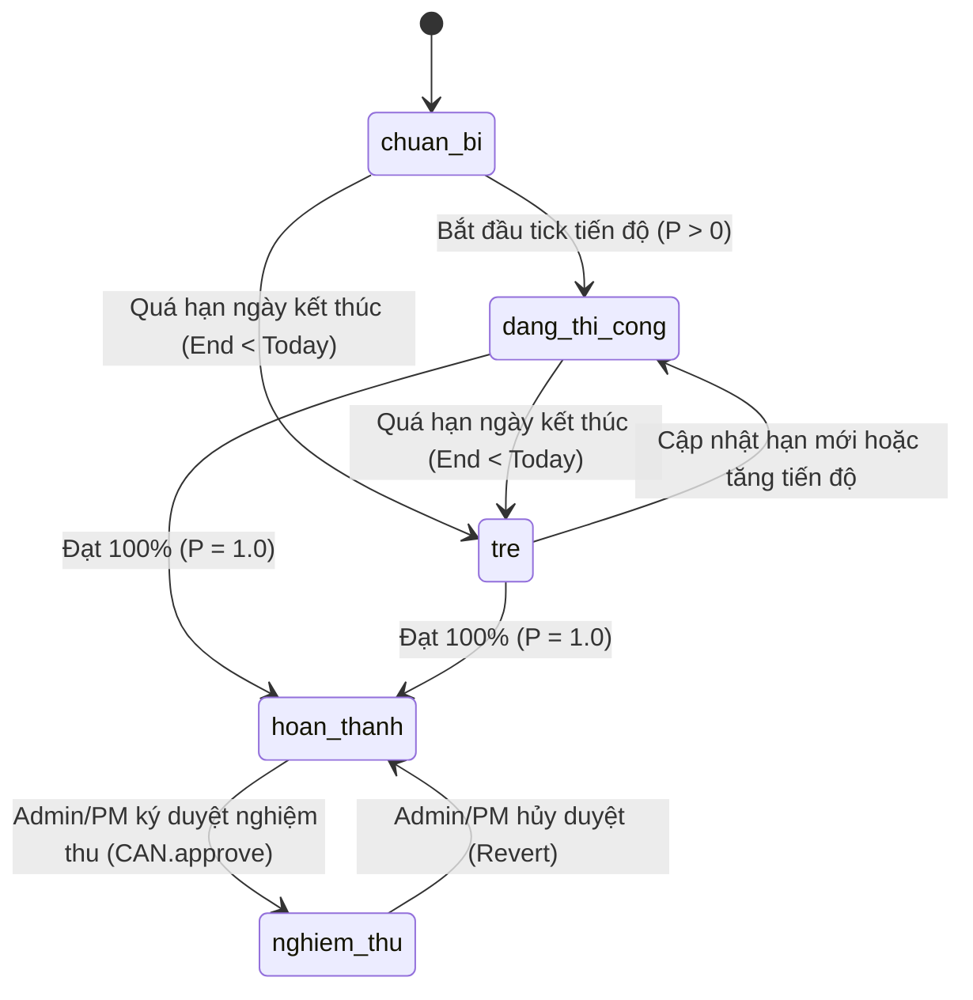

# CẨM NANG TỰ CÂN ĐỐI TRẠNG THÁI TIẾN ĐỘ & WBS (STATE MACHINE REPAIR RECIPES)

Tài liệu này cung cấp ma trận chuyển trạng thái hợp lệ và giải thuật tự động nắn chỉnh các mâu thuẫn trạng thái tiến độ WBS, nghiệm thu 2 bước và đường găng CPM trong XBoss.

---

## 1. MA TRẬN CHUYỂN TRẠNG THÁI HỢP LỆ (STATE TRANSITION MATRIX)

Hệ thống XBoss định nghĩa 5 trạng thái chuẩn trong `lib/status.ts`:

1. `chuan_bi` (Chuẩn bị / Chưa bắt đầu, $P = 0\%$)
2. `dang_thi_cong` (Đang thi công, $0\% < P < 100\%$)
3. `hoan_thanh` (Hoàn thành kỹ thuật, $P = 100\%$)
4. `tre` (Trễ hạn, $P < 100\% \land End < Today$)
5. `nghiem_thu` (Đã nghiệm thu pháp lý 2 bước, $P = 100\% \land \text{Approved}$)

---

## 2. NĂM NGUYÊN TẮC TỰ CÂN ĐỐI TRẠNG THÁI (AUTO-RECONCILIATION RULES)

### Quy tắc 1: Khóa Bất Biến Nghiệm Thu (Approval Lock)

- **Tình huống:** Người dùng gửi request đổi status thành `nghiem_thu` khi tiến độ công việc mới $60\%$.
- **Hành vi Tự Chữa Lành:**
  - Chặn trạng thái `nghiem_thu`.
  - Tự động gán trạng thái `dang_thi_cong`.
  - Trả về lý do: `"Công việc chưa đạt 100% (hiện tại 60%) -> không thể chuyển sang trạng thái Nghiệm thu"`.

### Quy tắc 2: Chống Hạ Cấp Tự Động Đối Với Đã Nghiệm Thu

- **Tình huống:** Tiến trình Cron định kỳ hoặc hàm tính toán lại phát hiện công việc đã quá hạn kết thúc (`End < Today`).
- **Hành vi Tự Chữa Lành:**
  - Nếu trạng thái hiện tại là `nghiem_thu`, TUYỆT ĐỐI KHÔNG chuyển sang `tre`.
  - Nghiệm thu là trạng thái hoàn tất tuyệt đối và chỉ có thể thay đổi khi có thao tác hủy duyệt tường minh của Admin/PM.

### Quy tắc 3: Tự Động Phục Hồi Dải Giá Trị Tiến Độ % (Progress Clamping & Scaling)

- **Tình huống:** Người dùng nhập `150`, `-20`, `NaN`, hoặc `null`.
- **Hành vi Tự Chữa Lành:**
  - `progress < 0` hoặc `NaN` $\rightarrow$ Đưa về `0.0`.
  - `1.0 < progress <= 100` $\rightarrow$ Hiểu là người dùng nhập phần trăm nguyên, chia cho $100$ ($85 \rightarrow 0.85$).
  - `progress > 100` $\rightarrow$ Giới hạn trần `1.0` ($100\%$).

### Quy tắc 4: Sửa Sai Lệch Thứ Tự Thời Gian (Start Date vs End Date Inversion)

- **Tình huống:** Người dùng nhập `start_date = 2026-08-25` và `end_date = 2026-08-20` (ngày bắt đầu sau ngày kết thúc).
- **Hành vi Tự Chữa Lành:**
  - Hệ thống phát hiện đảo lộn thứ tự thời gian.
  - Tự động hoán đổi: `start_date = 2026-08-20` và `end_date = 2026-08-25`.
  - Ghi nhận thông báo: `"Tự động hoán đổi ngày bắt đầu và kết thúc do ngày bắt đầu lớn hơn ngày kết thúc"`.

### Quy tắc 5: Bẻ Khóa Vòng Lặp Phụ Thuộc (Circular WBS Dependency Breaker)

- **Tình huống:** Người dùng gán Task A phụ thuộc Task B, Task B phụ thuộc Task C, Task C phụ thuộc Task A ($A \rightarrow B \rightarrow C \rightarrow A$).
- **Hành vi Tự Chữa Lành:**
  - Chạy thuật toán phát hiện chu trình (Tarjan / DFS Cycle Detection).
  - Tự động ngắt liên kết phụ thuộc mới nhất vừa được thêm vào ($C \rightarrow A$).
  - Giữ lại liên kết hợp lệ và hiển thị cảnh báo cho PM.
