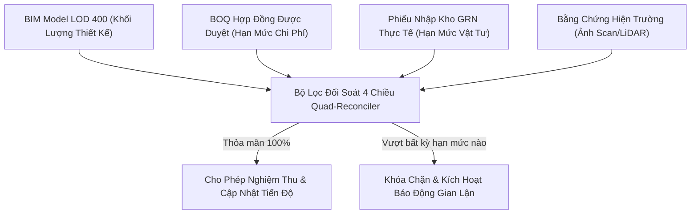

# GIAO THỨC CHỐNG GIAN DỐI HIỆN TRƯỜNG & BẢO VỆ TÍNH TOÀN VẸN SỐ LIỆU

## (ANTI-FRAUD FIELD PROTOCOLS & DATA INTEGRITY DEFENSE)

---

## 1. PHÂN LOẠI CÁC HÌNH THỨC GIAN LẬN HIỆN TRƯỜNG PHỔ BIẾN

Trong thực tế thi công, các hành vi gian dối thường tập trung vào 5 nhóm thủ đoạn:

```
┌────────────────────────────────────────────────────────────────────────┐
│                        5 NHÓM THỦ ĐOẠN GIAN LẬN                        │
├────────────────────────────────────────────────────────────────────────┤
│ 1. Gian lận Hình ảnh: Dùng ảnh cũ, ảnh mạng, chụp góc khuất            │
│ 2. Giả mạo Tọa độ & Thời gian: Fake GPS, chỉnh sửa EXIF timestamp      │
│ 3. Nghiệm khống Khối lượng: Báo cáo vượt BOQ, tính trùng đầu việc      │
│ 4. Nghiệm thu "Ma": Ký khống trên giấy, không ra hiện trường           │
│ 5. Gian lận Thử áp: Khóa cô lập van, bơm áp bù khi bị rò rỉ           │
└────────────────────────────────────────────────────────────────────────┘
```

---

## 2. GIAO THỨC THỬ THÁCH ĐỘNG (DYNAMIC CHALLENGE CODE PROTOCOL)

Để triệt tiêu triệt để việc dùng lại ảnh cũ hoặc chụp ảnh từ nơi khác:

1. **Sinh Mã Thử Thách Server-Side:**
   - Khi người dùng bấm "Chụp ảnh kiểm tra" trên App XBoss:
   - Server sinh mã HMAC ngắn: $\text{Code} = \text{HMAC-SHA256}(\text{ProjectID} + \text{UserID} + \text{Timestamp}) \pmod{16^6}$ (ví dụ: `#XB-7D9E`).
   - Mã có thời gian sống (TTL) là **90 giây**.
2. **Yêu cầu Khung hình:**
   - Kỹ sư phải đặt bảng mã thử thách (hoặc màn hình điện thoại thứ hai) trong góc khung hình hiện trường.
   - Ứng dụng PWA tự động chèn Watermark mật mã chứa toạ độ GPS, Sensor Pitch/Roll/Compass và Challenge Code vào luồng ảnh gốc trước khi nén.
3. **Thẩm định Tự động qua AI OCR & Hash Dedup:**
   - AI OCR trích xuất Challenge Code từ ảnh. Nếu code không khớp hoặc đã quá hạn $\rightarrow$ Từ chối lưu trữ (`ERROR_INVALID_CHALLENGE`).
   - Tính toán Perceptual Hash (pHash) và SHA-256: So sánh với cơ sở dữ liệu ảnh trong 30 ngày. Nếu độ tương đồng Hamming Distance $\le 3$ với ảnh đã tồn tại $\rightarrow$ Cảnh báo gian lận trùng lặp ảnh (`ERROR_DUPLICATE_PHOTO_FRAUD`).

---

## 3. LÁ CHẮN ĐỊA LÝ & CHỐNG GIẢ MẠO GPS (ANTI-FAKE-GPS & GEOFENCING SHIELD)

1. **Kiểm tra Cờ Mock Location:**
   - Kiểm tra `isFromMockProvider` trên Android / `isSimulated` trên iOS. Nếu phát hiện cờ giả lập $\rightarrow$ Lập tức khóa tính năng chụp ảnh và gắn cờ tài khoản.
2. **Kiểm tra Bán kính Geofence:**
   - Xác định tâm dự án $(Lat_0, Lng_0)$ và bán kính cho phép $R_{\text{max}} = 50\text{m}$.
   - Công thức khoảng cách Haversine:
     $$d = 2R \arcsin\left(\sqrt{\sin^2\left(\frac{\Delta \phi}{2}\right) + \cos(\phi_1)\cos(\phi_2)\sin^2\left(\frac{\Delta \lambda}{2}\right)}\right)$$
   - Nếu $d > 50\text{m} \rightarrow$ Từ chối ghi nhận và cảnh báo sai lệch vị trí (`OUT_OF_GEOFENCE`).

---

## 4. MA TRẬN ĐỐI SOÁT ĐỊNH LƯỢNG 4 CHIỀU (QUAD-RECONCILIATION)

Khối lượng thi công không được phép là một con số tùy ý của người nhập. Mọi số liệu phải qua bộ lọc 4 chiều:



- **Điều kiện ràng buộc:**
  $$Q_{\text{báo\_cáo}} \le Q_{\text{BIM}} \quad \text{và} \quad Q_{\text{báo\_cáo}} \le Q_{\text{BOQ}} \quad \text{và} \quad Q_{\text{báo\_cáo}} \le Q_{\text{Vật\_tư\_nhập}} - Q_{\text{Đã\_dùng}}$$

---

## 5. CHỐNG GIAN LẬN THỬ ÁP ĐƯỜNG ỐNG (PRESSURE TEST TAMPER PROOFING)

1. **Giám sát Viễn trắc Liên tục (Continuous IoT Telemetry):**
   - Áp kế điện tử gắn trên đầu mạng ống truyền dữ liệu $P(t)$ mỗi 10 giây.
   - Biểu đồ áp suất phải là đường thẳng hoặc suy giảm nhiệt độ chuẩn trong suốt thời gian thử ($\ge 2\text{h}$).
2. **Thuật toán Phát hiện Bơm Áp Bù Gian lận:**
   - Nếu trong quá trình thử, phát hiện đạo hàm áp suất $\frac{dP}{dt} > 0.05\text{ bar/phút}$ mà không có sự kiện ghi nhận của TVGS $\rightarrow$ Xác định có hành vi bơm bù áp để che giấu rò rỉ.
   - Hệ thống tự động hủy ca thử áp và phát hành phiếu NCR Cấp 2.
