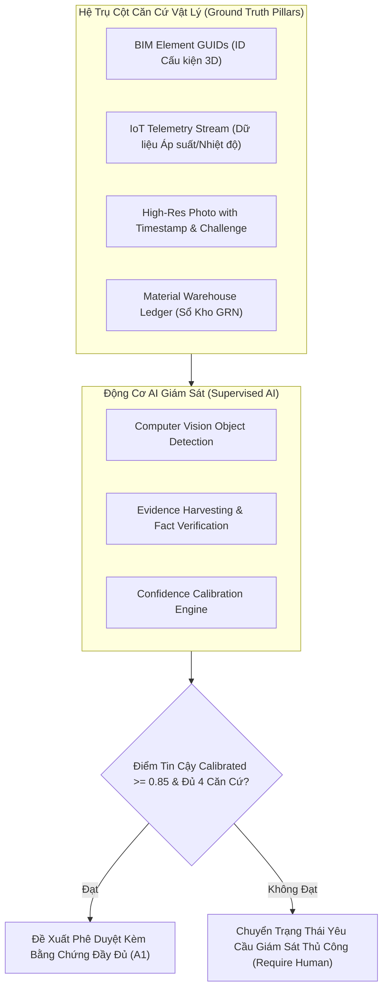

# QUY CHUẨN CHỐNG ẢO GIÁC AI & NEO CĂN CỨ THỰC TẾ

## (ANTI-HALLUCINATION AI GROUNDING & PHYSICAL TRUTH VERIFICATION)

---

## 1. NGUY CƠ ẢO GIÁC AI TRONG QUẢN TRỊ THI CÔNG

Khi áp dụng AI vào quản lý thi công, nguy cơ ảo giác (Hallucination) có thể gây ra hậu quả nghiêm trọng:

1. **Ảo giác Tiến độ (Progress Hallucination):** AI nhìn ảnh một bó ống ngổn ngang nhưng nhận định là "đã lắp đặt xong 100%".
2. **Ảo giác Khối lượng (Quantity Fabrication):** AI tự suy diễn số mét ống hoặc số lượng van dựa trên văn bản tóm tắt mà không đối chiếu bản vẽ.
3. **Ảo giác Phê duyệt (Premature Approval):** AI tự động chốt nghiệm thu khi thiếu các biên bản thử nghiệm bắt buộc (BBNT, thử áp).

---

## 2. KIẾN TRÚC NEO CĂN CỨ VẬT LÝ (PHYSICAL GROUND-TRUTH ANCHORING)

Mọi phân tích và đề xuất của AI trong XBoss BẮT BUỘC phải dựa trên 4 trụ cột căn cứ vật lý:

---

## 3. CÔNG THỨC HIỆU CHUẨN ĐỘ TIN CẬY (CONFIDENCE CALIBRATION ALGORITHM)

Độ tin cậy thô của mô hình thị giác máy tính ($C_{\text{raw}}$) được hiệu chuẩn qua ma trận điều kiện thực địa:

$$C_{\text{calibrated}} = C_{\text{raw}} \times f_{\text{light}} \times f_{\text{res}} \times f_{\text{geo}} \times f_{\text{element\_match}}$$

Trong đó:

- $f_{\text{light}} \in [0.5, 1.0]$: Hệ số ánh sáng (ảnh tối dưới tầng hầm bị phạt điểm).
- $f_{\text{res}} \in [0.7, 1.0]$: Hệ số độ phân giải (ảnh mờ/vỡ nét bị phạt điểm).
- $f_{\text{geo}} \in \{0.0, 1.0\}$: Hệ số toạ độ (sai GPS ngoài công trường $\rightarrow f_{\text{geo}} = 0$).
- $f_{\text{element\_match}} \in [0.6, 1.0]$: Tỷ lệ khớp giữa vật thể nhận diện với danh mục cấu kiện trong BIM/Shopdrawing.

### Quy tắc Hành động:

- **Nếu $C_{\text{calibrated}} \ge 0.85$:** Cho phép AI đưa ra đề xuất cập nhật tiến độ (Cấp A1).
- **Nếu $C_{\text{calibrated}} < 0.85$:** AI bị tước quyền đề xuất, gắn nhãn `UNCERTAIN_PHYSICAL_EVIDENCE` và yêu cầu Kỹ sư TVGS kiểm tra trực tiếp bằng mắt.

---

## 4. QUY TRÌNH TRANH BIỆN ĐA TÁC TỬ (SWARM DEBATE PROTOCOL)

Khi có thông tin tiến độ mới từ hiện trường, 4 Tác tử AI độc lập tiến hành thẩm tra chéo:

1. **`site-field-commander` (Hiện trường):** Trình diện ảnh chụp, vị trí Zone/Floor và khối lượng thi công.
2. **`qaqc-safety-sentinel` (Chất lượng):** Chất vấn: _"Đã kiểm tra khoảng cách ty treo chưa? Đã có kết quả thử áp chưa?"_.
3. **`qs-cost-contracts-master` (Chi phí):** Chất vấn: _"Khối lượng này có vượt BOQ gói thầu không? Vật tư tương ứng đã xuất kho chưa?"_.
4. **`schedule-evm-controller` (Tiến độ):** Phân tích: _"Tốc độ hoàn thành 200m ống trong 4 giờ có vượt định mức lao động 14 thợ không?"_.

Nếu có bất kỳ nghi vấn hoặc bất đồng nào $\rightarrow$ Hệ thống dừng quy trình tự động và xuất báo cáo tranh chấp kèm các câu hỏi chất vấn cho Kỹ sư trưởng phê duyệt.
