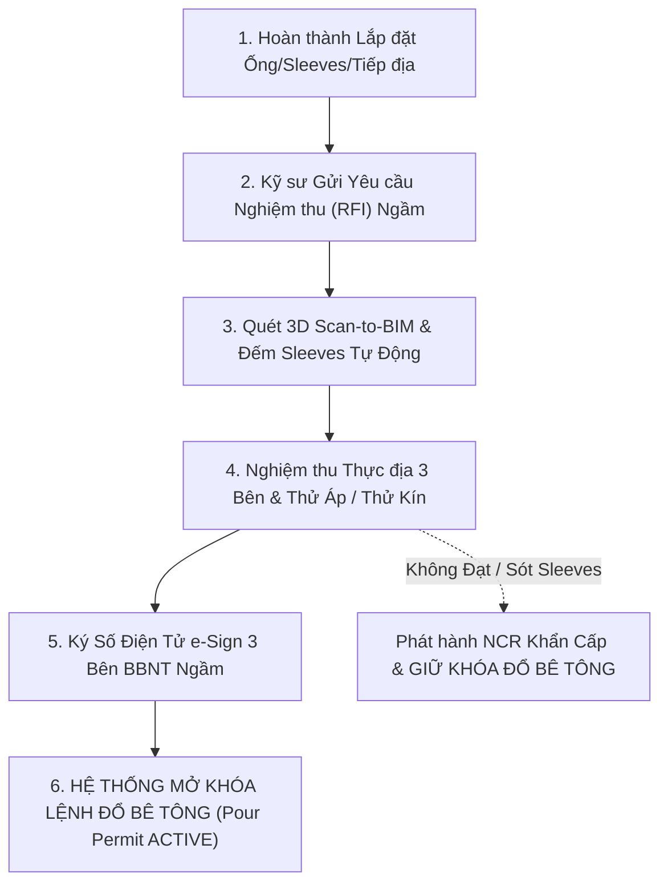

# QUY TRÌNH NGHIỆM THU CÔNG TÁC NGẦM & KHÓA CHẶN ĐỔ BÊ TÔNG

## (CONCEALED WORKS PROTOCOL & POUR-PERMIT CIRCUIT BREAKER SOP)

---

## 1. TẠI SAO CÔNG TÁC NGẦM/KHUẤT LÀ VÙNG RỦI RO SỐ 1?

Trong các công trình cao tầng, các hệ thống ống cơ điện đặt trong dầm sàn, cột vách hoặc chôn dưới nền đất một khi đã đổ bê tông hoặc lấp đất thì chi phí đục phá, sửa chữa có thể gấp $50 - 100$ lần chi phí lắp đặt ban đầu, đồng thời làm suy giảm nghiêm trọng khả năng chịu lực của kết cấu bê tông cốt thép.

Do đó, **Bất biến Khóa Chặn Công Tác Ngầm (Concealed-Work Lock Invariant)** là ranh giới bất khả xâm phạm.

---

## 2. QUY TRÌNH 6 BƯỚC CẤP PHÉP ĐỔ BÊ TÔNG (POUR PERMIT WORKFLOW)

---

## 3. CƠ CHẾ NGẮT MẠCH TỰ ĐỘNG (CIRCUIT BREAKER ENGINE)

Hệ thống XBoss áp dụng thuật toán ngắt mạch mềm (Software Circuit Breaker):

1. **Khởi tạo Khóa Vùng (Spatial Zone Lock):**
   - Khi tạo một kế hoạch đổ bê tông (ví dụ: `POUR-TOWER-A-F12-Z1`), hệ thống tự động quét toàn bộ WBS Tasks nằm trong phạm vi không gian `(Tower A, Floor 12, Zone 1)`.
2. **Kiểm tra Danh mục Tiên quyết (Prerequisite Check):**
   - Điều kiện để Lệnh đổ bê tông chuyển sang trạng thái `READY_FOR_POUR`:
     $$\forall \text{task} \in \text{ConcealedTasks}(\text{Zone}): \text{task.bbnt\_status} = \text{'SIGNED\_3\_PARTIES'} \quad \wedge \quad \text{task.pressure\_test} = \text{'PASSED'}$$
3. **Ngắt Mạch Tức Thời:**
   - Nếu có $\ge 1$ task ngầm chưa ký BBNT hoặc có phiếu NCR chưa đóng:
   - Trạng thái Lệnh đổ bê tông bị khóa ở mức `LOCKED_CIRCUIT_OPEN`.
   - API trả về HTTP 422 Unprocessable Entity kèm danh sách chính xác các vị trí ống/sleeve bị thiếu.
   - Gửi cảnh báo khẩn cấp Push Notification / Telegram tới Chỉ huy trưởng công trình.

---

## 4. BIÊN BẢN NGHIỆM THU ĐIỆN TỬ BẤT BIẾN (TAMPER-PROOF BBNT)

- BBNT công tác ngầm phải chứa:
  1. Tọa độ chính xác $(X, Y, Z)$ hoặc vị trí trục Shopdrawing.
  2. Bức ảnh chụp toàn cảnh sàn trước khi đổ có nhúng mã Dynamic Challenge Code.
  3. Chữ ký số mật mã HMAC-SHA256 của Kỹ sư Nhà thầu, Kỹ sư TVGS và Đại diện Chủ đầu tư.
  4. Mã kiểm toán duy nhất `CERT-BBNT-NGAM-[UUID]`.
