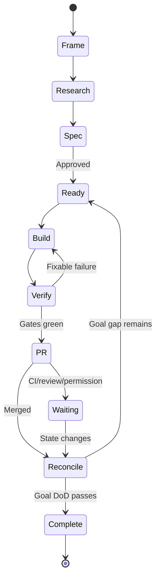

# Vòng lặp AI Delivery — XBoss

Vòng lặp này điều hành mục tiêu lớn qua nhiều issue/PR cho tới khi đạt Product/Project Complete.
Nó bổ sung, không thay thế, mô hình planner → coordinator → worker trong `CLAUDE.md`.

## 1. State machine



Mỗi vòng chỉ có một outcome và một PR. AI luôn bắt đầu lại từ trạng thái thật của `main`, không
dựa vào ký ức chat hoặc checklist cũ.

## 2. Cấu trúc mục tiêu

| Tầng      | Mục đích                        | Điều kiện xong                   |
| --------- | ------------------------------- | -------------------------------- |
| Goal      | Outcome lớn/Product Complete    | Metric + guardrail + final audit |
| Milestone | Capability phát hành/đo độc lập | Acceptance criteria              |
| Slice     | Thay đổi review được            | PR DoD + merged                  |

Mỗi goal dùng `docs/goals/<goal-id>.md`; mỗi feature dùng đặc tả `docs/nang-cap/Mxx-*.md`,
`Gxx-*.md` hoặc template chuẩn. `PROGRESS.md` vẫn là tóm tắt trạng thái toàn dự án.

## 3. Thuật toán một iteration

1. **Reload:** đọc `CLAUDE.md`, AGENTS, PROJECT, spec, PROGRESS, goal, ADR, code/test, GitHub/CI.
2. **Reconcile:** xác minh item bằng code/test/PR trên `main`; sửa trạng thái tài liệu bị lệch.
3. **Measure:** đo khoảng cách tới Goal DoD, metric và guardrail.
4. **Stop check:** COMPLETE nếu final audit đạt; BLOCKED nếu gặp điều kiện dừng.
5. **Select:** chọn slice Ready có value/risk-reduction cao nhất, không dependency mở.
6. **Research/Spec:** feature chưa có spec duyệt thì vòng này chỉ nghiên cứu/đặc tả, chưa code.
7. **Plan:** route, file/contract/schema, test, migration, rollout/rollback và budget.
8. **Build:** worker thi hành đúng spec; không mở rộng scope im lặng.
9. **Verify:** targeted test → release gate → audit hẹp → self-review.
10. **PR:** draft, link goal/issue/spec; xử lý CI/review trong phạm vi.
11. **Checkpoint:** sau merge cập nhật goal gap/evidence/risk/next slice, quay lại bước 1.

## 4. Cổng Research + Spec

Research phải truy được về code, test, dữ liệu hoặc nguồn chính thống và bao gồm:

- current flow, route, permission, project/org scope, DB contract và migration history;
- người dùng/vai trò công trường bị ảnh hưởng và baseline;
- các phương án kể cả không làm, trade-off và lý do chọn;
- offline/SSE/PWA, a11y desktop/mobile, performance và vận hành;
- auth/RBAC/SoD, dữ liệu tài chính-nghiệm thu, auditability và abuse/failure cases;
- giả định, câu hỏi mở, owner quyết định và ngày truy cập nguồn.

Spec chỉ Approved khi đủ DDL/API/điểm chạm code/AC, test, observability, rollout/rollback và mọi
quyết định blocking đã đóng.

## 5. Repair loop

Với cùng một failure, tối đa ba lần:

1. lưu command/error và giả thuyết;
2. sửa nguyên nhân nhỏ nhất;
3. chạy lại test lỗi rồi gate liên quan;
4. nếu vẫn lỗi hoặc cần đổi spec/contract, checkpoint BLOCKED.

Cấm xóa/skip test, hạ coverage/quality gate, nới permission/project scope hoặc sửa migration đã áp
để làm CI xanh.

## 6. Ưu tiên slice

1. rò dữ liệu, sai tiền/tiến độ/nghiệm thu, security và production correctness;
2. blocker mở khóa nhiều milestone;
3. research giảm uncertainty lớn;
4. user value cao/effort-risk thấp;
5. debt có tác động đo được.

Hai phương án có trade-off product/architecture đáng kể → dừng hỏi owner.

## 7. Điều kiện WAITING/BLOCKED

Dừng khi thiếu spec/approval; cần secret/production/chi phí/quyền mới; destructive/breaking schema;
đụng dữ liệu thật; CI/review ngoài scope; cùng failure quá ba lần; guardrail vượt ngưỡng; main đổi
làm plan mất hiệu lực; hoặc không còn item Ready nhưng goal chưa đạt.

WAITING dùng khi chờ CI/review/merge. Có thể nghiên cứu vòng sau nhưng không xây code phụ thuộc lên
base chưa merge.

## 8. Definition of Goal/Project Complete

- mọi AC có bằng chứng trên `main`;
- metric đạt trong cửa sổ đo và guardrail không suy giảm;
- không còn milestone bắt buộc, P0/P1, migration hoặc reconciliation dang dở;
- release gate, DB integration, E2E desktop/mobile, a11y và audit vùng rủi ro xanh;
- UAT đủ vai trò, production verification và restore/rollback drill nếu thuộc scope;
- docs/ADR/ERD/runbook/telemetry/ownership cập nhật;
- residual risk và out-of-scope ghi rõ;
- owner xác nhận Product Complete khi cần quyết định nghiệp vụ.

## 9. Checkpoint

```text
Iteration: <n> | State: RESEARCH/SPEC/READY/BUILD/VERIFY/WAITING/BLOCKED/COMPLETE
Main SHA:
Goal gap before/after:
Slice + spec/issue/PR:
Checks/test counts/metric evidence:
Risk/guardrail:
Decision:
Blocker:
Next best slice:
Permission needed:
```
