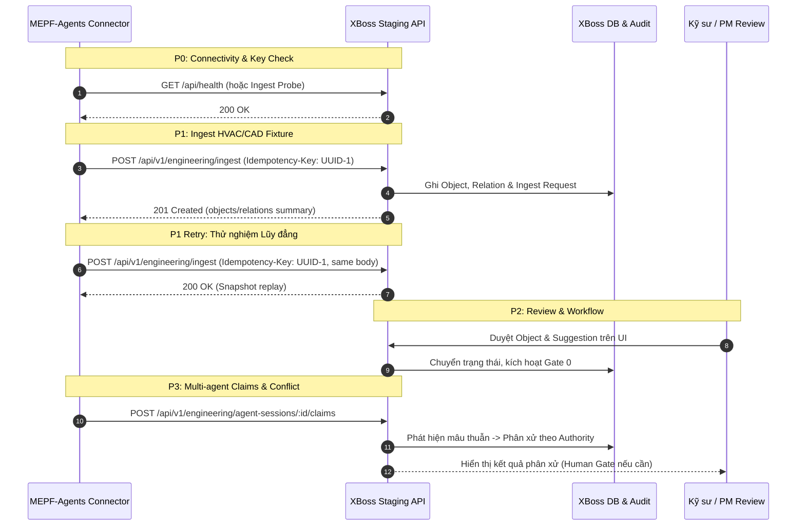

# Hướng dẫn Pilot Tích hợp MEPF-Agents ↔ XBoss (C2 Runbook)

> **Tài liệu chuẩn hóa:** C2 — MEPF-Agents Connector & End-to-End Pilot (`docs/nang-cap/C2-mepf-connector-pilot.md`)  
> **Phiên bản Hợp đồng (Contract Version):** `1.0`  
> **Repo đối tác:** [MEPF-Agents](https://github.com/seeker19110/MEPF-Agents)

---

## 1. Cấu hình Môi trường (Environment Configuration)

Phía connector MEPF-Agents cần khai báo các biến môi trường sau (tuyệt đối không hardcode bí mật):

| Biến môi trường              | Bắt buộc | Mô tả & Định dạng                                           |
| ---------------------------- | -------- | ----------------------------------------------------------- |
| `XBOSS_BASE_URL`             | Có       | URL của XBoss (VD: `https://staging.xboss.app`)             |
| `XBOSS_ENGINEERING_API_KEY`  | Có       | API Key định dạng `xbk_<hex>` có scope `engineering:ingest` |
| `XBOSS_PROJECT_EXTERNAL_KEY` | Có       | Khóa định danh dự án phía external (VD: `PRJ-AVIO-TOWER-A`) |
| `XBOSS_CONTRACT_VERSION`     | Có       | Luôn ghim cố định `1.0`                                     |
| `XBOSS_REQUEST_TIMEOUT_MS`   | Không    | Timeout mỗi request HTTP (mặc định: `15000` ms)             |
| `XBOSS_MAX_RETRIES`          | Không    | Số lần retry tối đa cho lỗi mạng/5xx (mặc định: `5`)        |

---

## 2. Các Endpoint Tích hợp Chính

### 2.1 Ingest Đối tượng & Quan hệ Kỹ thuật

- **Method & Path:** `POST /api/v1/engineering/ingest`
- **Headers bắt buộc:**
  - `Authorization: Bearer <XBOSS_ENGINEERING_API_KEY>`
  - `Idempotency-Key: <UUIDv4>`
  - `Content-Type: application/json`
- **Quy tắc lũy đẳng (Idempotency Protocol):**
  - Gửi lại cùng `Idempotency-Key` + cùng Payload → trả về HTTP `200 OK` kèm kết quả snapshot đã lưu (Replay an toàn).
  - Gửi lại cùng `Idempotency-Key` + khác Payload → trả về HTTP `409 Conflict` (Chặn ghi đè sai lệch).

### 2.2 Đăng ký Phiên Điều phối Agent & Gửi Claims

- **Tạo phiên:** `POST /api/v1/engineering/agent-sessions`
- **Gửi claims:** `POST /api/v1/engineering/agent-sessions/:id/claims`
- **Nguyên tắc phân xử:** Phân xử theo trật tự thẩm quyền nguồn (`sourceAuthority`: `primary_spec` > `measured` > `derived` > `heuristic`), **không dùng majority vote (đếm phiếu số đông)**.

---

## 3. Bộ Kịch bản Diễn tập Pilot (Staging Drills P0 → P4)

1. **Kịch bản P0 (Kết nối & Phân quyền):**
   - Cấp API Key dự án staging.
   - Gửi request thử nghiệm, xác nhận header `X-Correlation-Id` và redaction log không lộ token.
2. **Kịch bản P1 (Ingest xác định - Deterministic Ingest):**
   - Nạp fixture `01-happy-path.json` và `08-agent-claims-conflict.json`.
   - Gửi lại cùng key để kiểm tra tính năng replay lũy đẳng.
3. **Kịch bản P2 (Quy trình Duyệt & Intelligence):**
   - Người dùng PM/QA duyệt object trên giao diện `/engineering`.
   - Tạo workflow kỹ thuật theo ENG-3, ký gate tuần tự.
4. **Kịch bản P3 (Xung đột Đa Agent):**
   - Gửi các luận điểm đối lập nhau từ nhiều agent.
   - Xác nhận XBoss phân loại đúng (data / interpretation / constraint) và đề xuất phương án dựa trên nguồn có thẩm quyền cao nhất.
5. **Kịch bản P4 (Diễn tập Phục hồi Sự cố - Failure Drill):**
   - Giả lập timeout, 429 rate-limit, 5xx server tạm thời: connector phải retry với exponential backoff.
   - Thu hồi (revoke) API key: connector phải dừng queue ngay lập tức và gửi cảnh báo đến operator, không spam retry vô hạn.
