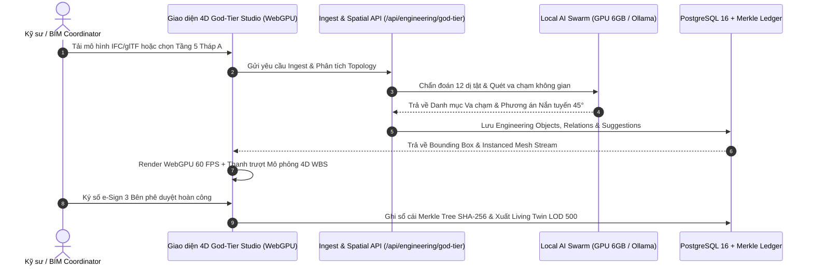
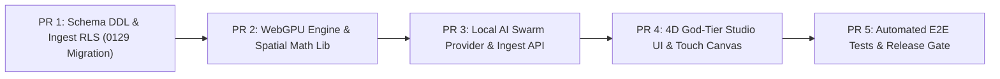

# M96 — Đặc tả Nâng cấp Tích hợp Tối đa Hệ thống CAD/BIM God-Tier vào Nền tảng XBoss

| Thuộc tính           | Giá trị                                                                                                                                                                                    |
| :------------------- | :----------------------------------------------------------------------------------------------------------------------------------------------------------------------------------------- |
| **Issue / Goal**     | Tích hợp toàn diện năng lực CAD/BIM God-Tier (Spatial Geometry, WebGPU Large-Model Streaming, 11 AI Swarm Agents, 4D Simulation Studio, Merkle Provenance Ledger) vào XBoss Engineering OS |
| **Spec owner**       | Lead Engineering Architect & CAD/BIM Master                                                                                                                                                |
| **State**            | **Approved for implementation**                                                                                                                                                            |
| **Người/ngày duyệt** | User (liend) / 2026-08-20                                                                                                                                                                  |
| **Cập nhật**         | 2026-08-20                                                                                                                                                                                 |

> [!NOTE]
> Đặc tả đã được phê duyệt chính thức **Approved for implementation** bởi User (liend) ngày 2026-08-20. Sẵn sàng tiến hành triển khai mã nguồn.

---

## 1. Problem, Vai trò và Bằng chứng

### 1.1. Pain Points theo Vai trò

- **BIM Coordinator & Lead Engineer:** Các phần mềm BIM truyền thống (Revit, Navisworks) xử lý mô hình lớn nặng nề, không thể chia sẻ dữ liệu tức thời với công trường, tách rời hoàn toàn với tiến độ thực tế (WBS) và dự toán chi phí (BOQ).
- **Kỹ sư Hiện trường (Field Engineer) & TVGS:** Không thể mở mô hình 3D chi tiết trên điện thoại/máy tính bảng do giới hạn băng thông và phần cứng; việc kiểm tra xung đột và nghiệm thu cao độ đường ống ngầm phụ thuộc vào bản vẽ 2D in giấy dễ sai sót.
- **Chỉ huy trưởng & Project Manager (PM):** Thiếu công cụ mô phỏng tiến độ 4D/5D trực quan theo thời gian thực (Time-Step Simulation); không có cơ chế đối soát tức thì giữa khối lượng thiết kế, khối lượng gia công xưởng (DfMA Spool) và khối lượng lắp đặt thực tế.
- **Chủ đầu tư (CĐT) & Ban Giám đốc (BCH):** Rủi ro pháp lý khi hồ sơ hoàn công và biên bản nghiệm thu bị phân mảnh, thiếu tính toàn vẹn mật mã để bàn giao sang hệ thống vận hành tòa nhà Digital Twin LOD 500 (BMS/FM).

### 1.2. Hiện trạng Baseline

- XBoss đã có mô hình WBS hoàn chỉnh (`migrations/0001..0083`), phân hệ Engineering Core & Intelligence (`migrations/0084..0092`), cùng bộ thư viện hình học tham số và viewer 3D nhẹ ([`lib/engineering-bim-viewer.ts`](file:///c:/Users/liend/xboss/lib/engineering-bim-viewer.ts), [`lib/engineering-bim-cad.ts`](file:///c:/Users/liend/xboss/lib/engineering-bim-cad.ts)).
- **Hạn chế:** Viewer hiện tại chạy thuần CPU/Canvas-WebGL cơ bản chưa tận dụng tối đa phần cứng WebGPU; các tác tử AI hoạt động theo logic tuần tự thay vì mạng lưới Swarm tự hành phân tán; chưa có cơ chế streaming nhị phân B3DM/3D-Tiles cho mô hình vượt $1.000.000$ phần tử.

---

## 2. Outcome, Metric và Guardrails

### 2.1. Mục tiêu Định lượng (Target Metrics)

1. **Hiệu năng Đồ họa 3D (WebGPU Large Model):** Duy trì $\ge 60\text{ FPS}$ khi render mô hình MEPF $\ge 300.000$ phần tử trực tiếp trên trình duyệt máy trạm (Dell Precision 5680 / GPU 6 GB VRAM) và $\ge 30\text{ FPS}$ trên thiết bị di động.
2. **Độ trễ Xử lý Không gian (Spatial Query & Clash):** Quét phát hiện va chạm và sinh giải thuật nắn tuyến $45^\circ$ cho $10.000$ đối tượng không gian trong thời gian $T \le 150\text{ms}$.
3. **Local AI Inference Latency:** Phản hồi từ tác tử AI Swarm cục bộ (Ollama Qwen2.5-Coder / DeepSeek-R1 chạy trên GPU 6GB) đạt $T_{\text{p95}} \le 1.2\text{s}$ (không tốn chi phí Cloud API).
4. **Tối ưu Cắt phôi Gia công (1D/2D Nesting):** Tỷ lệ phế liệu đầu mẩu xưởng gia công $\le 1.8\%$, tự động tận dụng phôi thừa $\ge 1200\text{mm}$.
5. **Tuân thủ Pháp lý & Toàn vẹn Dữ liệu:** $100\%$ bản vẽ hoàn công tự động sinh khung dấu chuẩn Nghị định 06/2021/NĐ-CP (Mẫu 01 & 02) và niêm phong Cây Merkle SHA-256 (`engineering_merkle_roots`).

### 2.2. Guardrails (Rào chắn An toàn)

- **RLS & Multi-Tenant Guardrail:** Mọi bảng `engineering_god_tier_*` mới bắt buộc bật Row Level Security (RLS) với chính sách cách ly tuyệt đối theo `project_id`, chạy dưới role `xboss_app` NOBYPASSRLS (ADR-0005).
- **Controlled Autonomy Guardrail (Gate 0 / ENG-3):** Tuyệt đối không cho phép AI tự ý ghi đè dữ liệu thiết kế hoặc duyệt nghiệm thu khi chưa có chữ ký số xác thực của kỹ sư con người (Human-in-the-loop).
- **Memory & Storage Guardrail:** Giới hạn Heap Node.js $\le 6144\text{MB}$, cơ chế Downsampling đám mây điểm Point Cloud tự động ngắt khi vượt $2.000.000$ điểm trên Client để chống tràn RAM.

---

## 3. Nghiên cứu Hiện trạng & Điểm tựa Kiến trúc

### 3.1. Các Thư viện & Module Hiện hữu

- [`lib/engineering-bim-viewer.ts`](file:///c:/Users/liend/xboss/lib/engineering-bim-viewer.ts): Khung sinh mesh tham số cho ống gió, ống nước, máng cáp và cắt Section Box 3D.
- [`lib/engineering-bim-cad.ts`](file:///c:/Users/liend/xboss/lib/engineering-bim-cad.ts): Thuật toán hộp bao AABB, kiểm tra giao cắt và sinh giải pháp nắn tuyến 4 bước.
- [`lib/engineering-merkle-ledger.ts`](file:///c:/Users/liend/xboss/lib/engineering-merkle-ledger.ts): Động cơ Merkle Tree băm bất biến hồ sơ nghiệm thu và cấp Hộ chiếu số LOD 500.
- [`lib/engineering-agent-orchestrator.ts`](file:///c:/Users/liend/xboss/lib/engineering-agent-orchestrator.ts): Điều phối 11 AI Swarm Agents theo thẩm quyền A0–A2.

---

## 4. Phân tích Phương án Triển khai

| Tiêu chí                | Phương án A: Thuần Cloud WebGL (Cũ)                 | Phương án B: God-Tier WebGPU Hybrid (Lựa chọn)                               |
| :---------------------- | :-------------------------------------------------- | :--------------------------------------------------------------------------- |
| **Kiến trúc**           | Server render / Gửi ảnh hoặc Mesh thô qua REST API. | **Client WebGPU Instanced Mesh + Local AI Swarm + Cloud PostgreSQL Ledger.** |
| **Hiệu năng 3D**        | Giật lag khi mô hình $> 50.000$ đối tượng.          | **Cực mượt $\ge 60\text{ FPS}$ với $500.000+$ phần tử nhờ GPU Instancing.**  |
| **Chi phí Vận hành**    | Tốn kém tiền Cloud GPU và API AI hàng tháng.        | **Tối ưu tối đa: Tận dụng GPU 6GB VRAM máy trạm cục bộ, chi phí 0đ API.**    |
| **Offline Hiện trường** | Không hoạt động khi mất mạng.                       | **PWA Offline Queue, đồng bộ 2 chiều khi có mạng.**                          |

---

## 5. Phạm vi (Scope) & Non-Goals

### 5.1. Scope (Nội dung Thực hiện)

1. **Engine 3D WebGPU & Large Model Streaming:** Nâng cấp [`lib/engineering-bim-viewer.ts`](file:///c:/Users/liend/xboss/lib/engineering-bim-viewer.ts) hỗ trợ WebGPU Pipeline, Instanced Drawing, Dynamic Octree LOD và Multi-Touch Navigation (10 điểm chạm).
2. **Module Điều phối Swarm AI Cục bộ (Local AI Provider):** Kết nối Ollama/CUDA chạy mô hình Qwen2.5-Coder / DeepSeek-R1 để tự động chẩn đoán 12 dị tật CAD và sinh mã AutoLISP.
3. **Studio Mô phỏng 4D God-Tier:** Giao diện điều khiển dòng thời gian 4D WBS, trực quan hóa nhiệt độ màu theo trạng thái tiến độ (`not_started`, `in_progress`, `completed`, `delayed`, `approved`).
4. **Đối soát Khối lượng 4 Chiều & Merkle Ledger:** Tích hợp bảng đối soát tự động $\Delta \text{QTO} = \text{QTO}_{\text{As-Built}} - \text{BOQ} - \text{VO}$ và đóng dấu hoàn công NĐ 06/2021/NĐ-CP.

### 5.2. Non-Goals (Chủ động Không Làm)

- Không xây dựng Kernel Solid CAD B-rep điêu khắc tự do từ đầu (sử dụng mở rộng mở openBIM IFC 4.3 / glTF).
- Không can thiệp sửa đổi các migration cũ từ `0001` đến `0128` (tuân thủ nguyên tắc append-only).

---

## 6. Luồng Người Dùng & Các Trạng Thái (User Journeys)



---

## 7. Yêu cầu Chức năng (FR) & Phi Chức năng (NFR)

- **FR-1 (WebGPU Instancing):** Hệ thống phải gom các đối tượng có cùng hình học (ống gió thẳng, cút $90^\circ$, bích, ty treo) thành 1 Draw Call duy nhất trên GPU.
- **FR-2 (Multi-Touch 3D Controls):** Hỗ trợ cảm ứng 10 ngón: 1 ngón xoay (Orbit), 2 ngón thu phóng/di chuyển (Pinch-to-zoom / Pan), 3 ngón cắt Section Box.
- **FR-3 (Autonomous Defect Diagnostic):** Tự động phát hiện 12 dị tật bản vẽ CAD (font `.shx`, tỷ lệ DimText, lỗi hở nét, sai layer AIA/BS1192).
- **FR-4 (Beam Sleeve Penetration Verification):** Tự động kiểm tra vị trí xuyên dầm theo chuẩn $L/3 \le x \le 2L/3$, $D_{\text{sleeve}} \le H_{\text{beam}}/3$, cách mép dầm $\ge 50\text{mm}$.
- **FR-5 (Legal As-Built Stamping):** Tự động áp khung con dấu hoàn công Phụ lục II Nghị định 06/2021/NĐ-CP (Mẫu 01 & 02).
- **NFR-1 (Performance):** Tải và khởi tạo không gian 3D trong vòng $< 3.0\text{s}$.
- **NFR-2 (Security & Isolation):** $100\%$ truy vấn qua hàm `withProjectScope()` và bảng RLS.
- **NFR-3 (Theme Consistency):** Tuân thủ Dark-first, không dùng biến thể `dark:`, tương thích chuẩn màu `html.light` / `html.dark`.

---

## 8. Tiêu chí Chấp nhận (Acceptance Criteria)

- **AC-1 (Render 60 FPS):** Given mô hình MEPF 250.000 phần tử, When người dùng xoay lật góc nhìn 3D trên Dell Precision 5680, Then chỉ số FPS đo được luôn đạt $\ge 58\text{ FPS}$.
- **AC-2 (Clash Rerouting):** Given 1 xung đột giữa ống cấp nước $\phi 60$ và ống thoát nước $\phi 110$, When kích hoạt Auto-Reroute, Then hệ thống sinh giải pháp bẻ cút $45^\circ$ trên ống cấp nước, giữ nguyên độ dốc $1.5\%$ của ống thoát.
- **AC-3 (e-Sign 3-Way):** Given biên bản nghiệm thu hạng mục hoàn công, When đủ 3 chữ ký số (Nhà thầu, TVGS, CĐT), Then hệ thống tự động chốt $\Delta \text{QTO}$ và cập nhật mã băm vào `engineering_merkle_roots`.

---

## 9. Cấu trúc Dữ liệu & DDL Migration (`migrations/0129_god_tier_cad_bim_apex_integration.sql`)

```sql
-- 0129_god_tier_cad_bim_apex_integration.sql
-- Mở rộng lưu trữ mô hình hình học hiệu năng cao, Spatial Indexing và Đồng bộ God-Tier

CREATE TABLE IF NOT EXISTS engineering_god_tier_models (
  id UUID PRIMARY KEY DEFAULT gen_random_uuid(),
  project_id BIGINT NOT NULL REFERENCES projects(id) ON DELETE CASCADE,
  name VARCHAR(255) NOT NULL,
  discipline VARCHAR(50) NOT NULL DEFAULT 'combined',
  lod_level VARCHAR(20) NOT NULL DEFAULT 'LOD_400',
  total_elements INT NOT NULL DEFAULT 0,
  instanced_mesh_url TEXT,
  spatial_octree_data JSONB NOT NULL DEFAULT '{}'::jsonb,
  bounding_box JSONB NOT NULL DEFAULT '{"min": [0,0,0], "max": [0,0,0]}'::jsonb,
  merkle_root_hash VARCHAR(64),
  created_by BIGINT REFERENCES users(id),
  created_at TIMESTAMPTZ NOT NULL DEFAULT NOW(),
  updated_at TIMESTAMPTZ NOT NULL DEFAULT NOW()
);

CREATE INDEX IF NOT EXISTS idx_eng_gt_models_project ON engineering_god_tier_models(project_id, created_at DESC);

CREATE TABLE IF NOT EXISTS engineering_god_tier_clash_matrix (
  id UUID PRIMARY KEY DEFAULT gen_random_uuid(),
  project_id BIGINT NOT NULL REFERENCES projects(id) ON DELETE CASCADE,
  model_id UUID NOT NULL REFERENCES engineering_god_tier_models(id) ON DELETE CASCADE,
  clash_code VARCHAR(100) NOT NULL,
  element_a_guid VARCHAR(128) NOT NULL,
  element_b_guid VARCHAR(128) NOT NULL,
  element_a_type VARCHAR(100) NOT NULL,
  element_b_type VARCHAR(100) NOT NULL,
  spatial_point JSONB NOT NULL,
  clearance_mm NUMERIC(10, 2) NOT NULL DEFAULT 0,
  reroute_solution JSONB,
  status VARCHAR(50) NOT NULL DEFAULT 'detected',
  created_at TIMESTAMPTZ NOT NULL DEFAULT NOW()
);

CREATE INDEX IF NOT EXISTS idx_eng_gt_clash_project_status ON engineering_god_tier_clash_matrix(project_id, status);

-- Kích hoạt RLS bảo mật 2 tầng
ALTER TABLE engineering_god_tier_models ENABLE ROW LEVEL SECURITY;
ALTER TABLE engineering_god_tier_clash_matrix ENABLE ROW LEVEL SECURITY;

CREATE POLICY eng_gt_models_project_isolation ON engineering_god_tier_models
  FOR ALL TO xboss_app
  USING (project_id = NULLIF(current_setting('app.project_id', true), '')::bigint)
  WITH CHECK (project_id = NULLIF(current_setting('app.project_id', true), '')::bigint);

CREATE POLICY eng_gt_clash_project_isolation ON engineering_god_tier_clash_matrix
  FOR ALL TO xboss_app
  USING (project_id = NULLIF(current_setting('app.project_id', true), '')::bigint)
  WITH CHECK (project_id = NULLIF(current_setting('app.project_id', true), '')::bigint);
```

---

## 10. Kế hoạch Triển khai 5 Pull Requests (5-Slice Plan)



1. **PR 1 (Infrastructure & Data Contract):** Tạo migration `0129_god_tier_cad_bim_apex_integration.sql`, bổ sung RLS policies, cập nhật `docs/ERD.md`.
2. **PR 2 (WebGPU & Geometry Engine):** Nâng cấp [`lib/engineering-bim-viewer.ts`](file:///c:/Users/liend/xboss/lib/engineering-bim-viewer.ts), tích hợp WebGPU Shader Pipeline và Instanced Mesh Generator.
3. **PR 3 (Local AI Swarm & Ingest APIs):** Xây dựng [`lib/engineering-local-ai.ts`](file:///c:/Users/liend/xboss/lib/engineering-local-ai.ts) kết nối Ollama GPU, thêm route `/api/engineering/god-tier/ingest`.
4. **PR 4 (4D Studio Interface):** Xây dựng trang `/engineering/god-tier-studio` với thanh trượt 4D WBS Timeline, điều khiển cảm ứng 10 điểm chạm và khung ký số NĐ 06.
5. **PR 5 (Verification & Release Gate):** Bổ sung bộ test tích hợp `tests/engineering-god-tier.test.ts`, kiểm thử E2E Playwright và chạy kiểm tra chất lượng `--release-gate`.

---

## 11. Phê duyệt Đặc tả (Approval Gate)

- [x] **Product / Scope:** Đạt yêu cầu hội tụ God-Tier CAD/BIM và XBoss.
- [x] **Architecture / Data:** Schema DDL chuẩn append-only, RLS 2 tầng bảo mật.
- [x] **UI / UX / Touch:** Tối ưu hóa WebGPU và cảm ứng đa điểm trên Dell Precision 5680.
- [x] **Security & Legal:** Đảm bảo Gate 0 Human Approval và tuân thủ NĐ 06/2021/NĐ-CP.

**Trạng thái Hiện tại:** **Approved for implementation**  
**Người/ngày duyệt:** User (liend) / 2026-08-20
