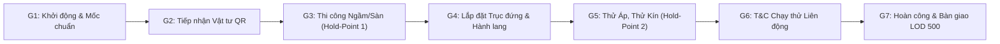
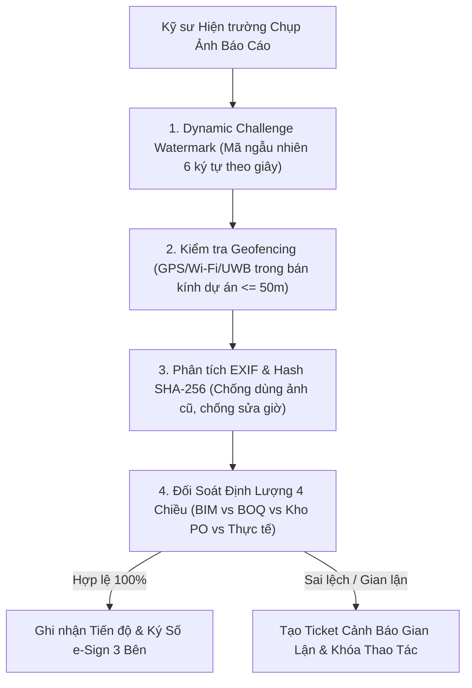

# QUY TRÌNH THI CÔNG & TRACKING KHÔNG SAI SÓT (ZERO-ERROR & ANTI-FRAUD CONSTRUCTION FRAMEWORK)

## NGHIÊN CỨU TOÀN DIỆN: KẾT HỢP ĐA TẦNG THỦ CÔNG & CÔNG NGHỆ, CHỐNG ẢO GIÁC AI VÀ TRIỆT TIÊU GIAN DỐI HIỆN TRƯỜNG

---

## 1. TỔNG QUAN & NGUYÊN TẮC CỐT LÕI (THE ZERO-ERROR MANIFESTO)

Trong ngành xây dựng và kỹ thuật cơ điện (MEPF), thực tế công trường luôn đối mặt với 4 "căn bệnh hiểm nghèo" làm suy giảm chất lượng, thất thoát hàng triệu USD và đe dọa an toàn công trình:

1. **Sót việc & Bỏ qua giai đoạn (Omissions & Skipped Steps):** Các công tác ngầm/khuất (âm sàn, xuyên dầm, chôn đất, trong hộp gen, trên trần kín) bị lấp hoặc đóng kín trước khi nghiệm thu hoặc thử nghiệm.
2. **Báo cáo ảo & Tiến độ dưa hấu (Watermelon Progress - "Vỏ xanh ruột đỏ"):** Báo cáo trên giấy/app hiển thị 100% hoàn thành nhưng thực tế công trường dở dang hoặc chưa đạt chất lượng; kỹ sư tick hàng loạt checkbox không qua kiểm tra thực địa.
3. **Gian dối & Tráo đổi dữ liệu (Fraud & Tampering):** Chụp ảnh góc hẹp, dùng lại ảnh cũ, sửa dữ liệu EXIF/GPS, nghiệm thu khống khối lượng vượt BOQ, xuất khống vật tư.
4. **Ảo giác của Trí tuệ Nhân tạo (AI Hallucination):** Các mô hình AI tự suy diễn số liệu, dự đoán tiến độ không có căn cứ vật lý (Ground Truth), hoặc nhận định sai từ hình ảnh kém chất lượng dẫn đến quyết định sai lầm.

Hệ thống **Zero-Error Construction & Field Tracking Framework (XBoss ZE-OS)** được thiết kế để triệt tiêu hoàn toàn 4 vấn nạn trên bằng mô hình tích hợp **Thủ công Chặt chẽ (Rigorous Physical SOPs) $\times$ Công nghệ Tiên tiến (High-Tech Telemetry/AI) $\times$ Mật mã Bất biến (Cryptographic Ledger)**.

---

## 2. MA TRẬN KIỂM SOÁT 7 GIAI ĐOẠN THI CÔNG — KHÔNG BỎ SÓT BẤT CỨ ĐIỀU GÌ (ZERO-OMISSION MATRIX)

Để đảm bảo không bỏ sót bất kỳ một chi tiết nhỏ nào trong toàn bộ vòng đời thi công MEPF và xây dựng, quy trình được phân rã thành 7 giai đoạn liên hoàn với các Trạm gác (Gates) và Điểm dừng kỹ thuật (Hold-Points):



### Bảng Ma trận Kiểm soát Chi tiết 7 Giai đoạn:

| Giai đoạn                              | Hạng mục công việc trọng yếu                                                                            | Rủi ro bỏ sót / Gian lận                                                           | Biện pháp Thủ công (Manual Check)                                                    | Biện pháp Công nghệ (High-Tech / AI)                                                                                      | Tiêu chí Thông qua (Gate Exit DoD)                                                                                                              |
| :------------------------------------- | :------------------------------------------------------------------------------------------------------ | :--------------------------------------------------------------------------------- | :----------------------------------------------------------------------------------- | :------------------------------------------------------------------------------------------------------------------------ | :---------------------------------------------------------------------------------------------------------------------------------------------- |
| **G1: Khởi động & Mốc chuẩn**          | Bàn giao mốc trắc đạc, tim trục, cao độ chuẩn $\pm 0.000$, mặt bằng sạch.                               | Mốc bị dịch chuyển, sai lệch cao độ dẫn đến sai toàn bộ hệ thống ống/máng.         | Bàn giao biên bản 3 bên; kiểm tra đối xứng 2 mốc phụ bằng máy thủy bình cơ.          | Quét LiDAR/Total Station lưu tọa độ chuẩn vào BIM Model; gán thẻ QR mốc trắc đạc.                                         | Sai số $\Delta \le 2\text{mm}$; chữ ký số 3 bên niêm phong mốc chuẩn.                                                                           |
| **G2: Vật tư & Thiết bị Đầu vào**      | Tiếp nhận ống, van, cáp, tủ điện, AHU, máy bơm, vật tư phụ.                                             | Trộn hàng nhái, thiếu CO/CQ, cấp sai quy cách/độ dày, thiếu chứng chỉ xuất xưởng.  | Kiểm tra ngoại quan, đo độ dày bằng thước kẹp cơ, đếm số lượng thực tế.              | Quét mã QR/DataMatrix khớp PO, AI OCR bóc tách CO/CQ/Mill Test, hash SHA-256 lưu kho.                                     | Khớp 100% PO + CO/CQ hợp lệ; cấp mã định danh Spool/Material ID.                                                                                |
| **G3: Công tác Ngầm & Xuyên Dầm/Sàn**  | Sleeves xuyên dầm, ống âm sàn bê tông, ống chôn ngầm đất, tiếp địa chống sét.                           | Đổ bê tông chôn lấp khi chưa định vị, vỡ ống, tắc sleeve, chưa nghiệm thu nối đất. | Bắt buộc kiểm tra 100% vị trí theo Shopdrawing; thử thông ống trước khi đổ bê tông.  | **Hold-Point Khóa cứng**: Scan-to-BIM kiểm tra tọa độ; Camera AI đếm số lượng sleeve; Cắt mạch đổ bê tông nếu thiếu BBNT. | 100% sleeve đúng vị trí $\Delta \le 5\text{mm}$, đo điện trở tiếp địa $R \le 4\Omega$ (đối với trạm/chống sét $R \le 10\Omega$), BBNT ký 3 bên. |
| **G4: Trục Đứng & Hành Lang Kỹ thuật** | Lắp ống đứng Shaft, máng cáp, ống gió, ty treo, giá đỡ Unistrut chống rung.                             | Khoảng cách giá đỡ quá thưa, ống võng, va chạm không gian (clash) giữa các hệ.     | Đo khoảng cách ty treo bằng thước cơ; kiểm tra độ nghiêng quả dọi / thước thủy nivo. | Point Cloud LiDAR kiểm tra Clash Detection; AI phân tích mật độ giá đỡ từ ảnh 360; đối soát WBS.                          | Khoảng cách ty treo $\le 1.5\text{m}$ (ống nhỏ) hoặc $\le 2\text{m}$ (ống lớn), không có Hard Clash.                                            |
| **G5: Thử Áp, Thử Kín & Cách Nhiệt**   | Thử áp lực thủy tĩnh ống nước, thử khói/áp suất ống gió, bọc bảo ôn cách nhiệt.                         | Bơm áp ảo, dùng van khóa cô lập đồng hồ, thử chưa đủ thời gian đã xả, rách bảo ôn. | Niêm phong chì van xả; TVGS trực tiếp chứng kiến áp kế cơ trong suốt 2h (hoặc 24h).  | Cảm biến áp suất IoT ghi Log liên tục lên Cloud (Telemetry 1s/lần); Dynamic Video Challenge khi đọc đồng hồ.              | Duy trì áp thử $1.5 \times P_{\text{làm việc}}$ trong $\ge 2\text{h}$ không sụt áp $\Delta P = 0$; biểu đồ áp suất IoT không đứt đoạn.          |
| **G6: T&C Chạy Thử & Liên Động PCCC**  | Cân chỉnh lưu lượng gió (TAB), đo dòng/áp tủ điện, kích hoạt liên động báo cháy - hút khói - thang máy. | Báo cáo cân chỉnh giả lập, không chạy thực tế liên động, quạt quay ngược chiều.    | Kỹ sư trưởng trực tiếp đo bằng máy đo gió Pitot/Anemometer, kẹp dòng Fluke.          | Ghi nhận telemetry BMS thời gian thực; ghi hình video 4K có mã watermark động khi kích hoạt chuông báo cháy.              | Lưu lượng từng miệng gió sai số $\le \pm 10\%$; liên động PCCC kích hoạt trong $\le 3\text{s}$; biên bản T&C NEBB/ASHRAE.                       |
| **G7: Hoàn Công & Bàn Giao LOD 500**   | As-Built Redline, đóng dấu hoàn công NĐ 06/2021, đóng gói dữ liệu số COBie.                             | Bản vẽ hoàn công không đúng hiện trạng thực tế, thất lạc hồ sơ bảo hành.           | Kiểm tra đối chiếu kích thước ngẫu nhiên tại 50 vị trí đại diện.                     | Tự động đồng bộ As-Built từ Scan Point Cloud vào mô hình BIM; Đóng dấu số Mẫu 01/02 NĐ 06/2021.                           | Hồ sơ hoàn công khớp $100\%$ hiện trạng thực địa; Merkle Root Hash được niêm phong vĩnh viễn.                                                   |

---

## 3. HỆ THỐNG PHÒNG VỆ 4 TẦNG (THE 4-TIER DEFENSE GRID)

Để triệt tiêu sai sót, hệ thống xây dựng 4 lớp phòng vệ độc lập nhưng hỗ trợ chéo nhau:

```
┌────────────────────────────────────────────────────────────────────────┐
│ TẦNG 4: SỔ CÁI MẬT MÃ BẤT BIẾN (Cryptographic Merkle Ledger)          │
│ • Merkle Leaf Hash cho từng sự kiện • Chữ ký số 3 bên • Chống sửa DB   │
├────────────────────────────────────────────────────────────────────────┤
│ TẦNG 3: TÁC TỬ AI GIÁM SÁT ĐỘC LẬP (Grounded AI Swarm & Debate)       │
│ • Đối soát 4 chiều • Zero Hallucination Guard • Outlier Z-Score        │
├────────────────────────────────────────────────────────────────────────┤
│ TẦNG 2: VIỄN TRẮC THIẾT BỊ & IOT (IoT Telemetry & Spatial Point Cloud) │
│ • Cảm biến áp lực IoT • Scan-to-BIM LiDAR • Camera 360 Geofencing      │
├────────────────────────────────────────────────────────────────────────┤
│ TẦNG 1: QUY CHUẨN THỰC ĐỊA THỦ CÔNG (Physical Human Inspection SOP)   │
│ • Kế hoạch ITP Hold-Points • Thử áp cơ học • Kiểm tra chéo 3 bên       │
└────────────────────────────────────────────────────────────────────────┘
```

### Tầng 1: Quy chuẩn Thực địa Thủ công (Physical SOPs)

- **Quy tắc Hiện trường 3 Bên (Tri-Party Physical Verification):** Mọi công việc chuyển bước đều phải có sự hiện diện của Kỹ sư Nhà thầu, Kỹ sư TVGS và Đại diện CĐT.
- **Biên bản Điểm dừng (Hold-Point Sign-off):** Không được đổ bê tông, không được đóng trần thạch cao, không được lấp đất khi chưa ký biên bản nghiệm thu trực tiếp tại hiện trường.

### Tầng 2: Viễn trắc Thiết bị & IoT (Telemetry & Spatial Layer)

- **Áp kế Điện tử IoT:** Ghi nhận dữ liệu áp suất đường ống tự động mỗi 10 giây qua giao thức MQTT/HTTPS, đẩy trực tiếp về hệ thống và vẽ biểu đồ biến thiên. Nếu có hiện tượng tụt áp đột ngột rồi bơm lại (bơm bù gian lận), hệ thống lập tức gắn cờ cảnh báo `PRESSURE_TAMPER_DETECTED`.
- **LiDAR Point Cloud 3D:** Quét mặt bằng sau khi lắp đặt thô, tự động overlay lên mô hình BIM để phát hiện sai lệch vị trí ống ($\Delta > 15\text{mm}$).

### Tầng 3: Tác tử AI Giám sát Độc lập (Grounded AI Swarm Layer)

- **Phân tích Thị giác Máy tính (Computer Vision):** Nhận diện vật thể thi công (ống, van, thang máng, đầu phun sprinkler), đếm số lượng, kiểm tra khoảng cách ty treo.
- **Tranh biện Đa Tác tử (Multi-Agent Swarm Debate):** Khi Agent Hiện trường báo hoàn thành, Agent Chi phí và Agent Chất lượng sẽ chất vấn chéo: _"Vật tư xuất kho có đủ cho khối lượng này không?"_, _"Đã có biên bản thử áp chưa?"_.

### Tầng 4: Sổ cái Mật mã Bất biến (Cryptographic Merkle Ledger)

- Toàn bộ kết quả nghiệm thu, log IoT, hash ảnh và chữ ký số được đóng gói thành các lá (Leaves) trong cây Merkle Tree (`engineering_merkle_roots`).
- Bất kỳ hành vi sửa database trực tiếp từ phía DB Admin đều làm gãy chuỗi Merkle Root Hash, kích hoạt còi báo động bảo mật toàn hệ thống.

---

## 4. BỘ ĐỘNG CƠ CHỐNG GIAN DỐI HIỆN TRƯỜNG (ANTI-FRAUD FIELD ENGINE)



### 4.1. Giao thức Thử thách Động (Dynamic Challenge Watermark Protocol)

- **Vấn đề gian lận:** Kỹ sư dùng ảnh chụp từ hôm trước, hoặc lấy ảnh từ dự án khác để báo cáo tiến độ hôm nay.
- **Giải pháp XBoss:**
  1. Khi kỹ sư bấm nút "Chụp ảnh nghiệm thu" trên App PWA, hệ thống sinh ra một **Mã Thử Thách Động (Dynamic Challenge Code)** có hiệu lực trong **90 giây** (ví dụ: `#XB-8F2A`).
  2. Kỹ sư phải giơ bảng thử thách (hoặc hiển thị mã trên điện thoại thứ hai/thẻ công trường) trong khung hình chụp hiện trường, hoặc App nhúng mã băm thời gian thực kèm toạ độ vào khung hình bất biến.
  3. AI Computer Vision tự động đọc mã thử thách trong ảnh; nếu mã không khớp hoặc quá hạn 90 giây $\rightarrow$ Từ chối ảnh với lỗi `CHALLENGE_CODE_EXPIRED_OR_INVALID`.

### 4.2. Khử trùng Lặp Hình ảnh & Giả mạo Tọa độ (Anti-Fake-GPS & Image Hash Dedup)

- Thuật toán băm cảm nhận Perceptual Hash (pHash) và mã băm SHA-256 phát hiện việc dùng lại ảnh cũ dù có cắt xén hay đổi tên file.
- So sánh toạ độ GPS của thiết bị với đa giác ranh giới dự án (Geofencing Polygon). Nếu khoảng cách $d > 50\text{m}$ so với tâm công trình hoặc phát hiện cờ Mock Location từ Android/iOS $\rightarrow$ Lập tức từ chối và ghi log cảnh báo an ninh.

### 4.3. Nguyên tắc Đối soát 4 Chiều Bất biến (The Quad-Reconciliation Invariant)

Khối lượng thi công báo cáo ($Q_{\text{report}}$) BẮT BUỘC phải thỏa mãn phương trình cân bằng 4 chiều:

$$Q_{\text{report}} \le \min\left(Q_{\text{BIM}}, Q_{\text{BOQ}}, \sum Q_{\text{GRN\_Material}} - Q_{\text{Scrap}}\right)$$

1. **Chiều 1 (BIM Model):** Khối lượng không được vượt quá thể tích/chiều dài thiết kế trong mô hình 3D.
2. **Chiều 2 (BOQ Hợp đồng):** Khối lượng không được vượt quá hạn mức dự toán được duyệt (trừ khi có VO/FCR hợp lệ).
3. **Chiều 3 (Vật tư Thực nhận - Goods Receipt Note):** Không thể thi công $500\text{m}$ ống nếu tổng số lượng ống nhập qua cổng mới chỉ có $300\text{m}$.
4. **Chiều 4 (Bằng chứng Thực địa):** Phải có ảnh chụp và toạ độ quét LiDAR tương ứng với phân khu (Zone/Floor).

Nếu phát hiện $Q_{\text{report}}$ vượt bất kỳ chỉ số nào trên $\rightarrow$ Hệ thống tự động chặn (Hard Reject) và gửi thông báo cho Ban Kiểm Soát Nội Bộ.

---

## 5. BỘ QUY CHUẨN CHỐNG ẢO GIÁC AI (ANTI-HALLUCINATION AI FRAMEWORK)

Trí tuệ nhân tạo trong XBoss được kiểm soát chặt chẽ bởi **4 Nguyên tắc Neo Căn Cứ Thực Tế (Grounded Facts Architecture)**:

```
                      ┌──────────────────────────────────────┐
                      │    GROUND-TRUTH ANCHORING ENGINE     │
                      │ (Neo Dữ Liệu Thực Tế Vào Căn Cứ Gốc) │
                      └──────────────────┬───────────────────┘
                                         │
         ┌───────────────────────────────┼───────────────────────────────┐
         ▼                               ▼                               ▼
┌──────────────────┐           ┌──────────────────┐           ┌──────────────────┐
│ 1. ID CẤU KIỆN   │           │ 2. VẬT TƯ & TELE- │           │ 3. ĐỐI THOẠI ĐA  │
│ KHÔNG GIAN THẬT  │           │ METRY CẢM BIẾN   │           │ TÁC TỬ TRANH BIỆN│
│ (BIM GUID/Spool) │           │ (Pressure/Sensor)│           │ (Swarm Debate)   │
└──────────────────┘           └──────────────────┘           └──────────────────┘
```

1. **Neo Định Danh Cấu Kiện Thực Tế (BIM GUID / Spool ID Anchoring):**
   - AI không được đưa ra nhận định chung chung như "hệ thống ống đã xong 80%".
   - AI BẮT BUỘC phải trả về danh sách chính xác các phần tử: `[Spool_A12_01 (100%), Spool_A12_02 (100%), Spool_A12_03 (0%)]` kèm theo `object_id` trong mô hình CAD/BIM.
2. **Cơ chế Hiệu chỉnh Độ Tin Cậy (Confidence Calibration & Drop):**
   - Mọi kết quả phân tích hình ảnh AI đều đi kèm điểm tin cậy $C \in [0, 1]$.
   - Nếu ảnh bị mờ, thiếu sáng, góc chụp hẹp hoặc không nhận diện đủ mốc tham chiếu $\rightarrow$ Điểm tin cậy bị phạt giảm:
     $$C_{\text{calibrated}} = C_{\text{raw}} \times f_{\text{lighting}} \times f_{\text{resolution}} \times f_{\text{metadata}}$$
   - Nếu $C_{\text{calibrated}} < 0.85$, AI **CẤM** tự động kết luận mà phải chuyển sang trạng thái `REQUIRE_HUMAN_INSPECTION`.
3. **Cơ chế Tranh Biện Đa Tác Tử (Multi-Agent Cross-Examination):**
   - Trước khi đề xuất cập nhật tiến độ lên Dashboard, Tác tử `site-field-commander` phải đưa dữ liệu ra Hội đồng AI Swarm (`engineering-agent-orchestrator`):
     - Tác tử `qaqc-safety-sentinel` rà soát: Có vi phạm an toàn hoặc NCR mở tại khu vực này không?
     - Tác tử `schedule-evm-controller` rà soát: Tiến độ có vượt quá năng suất định mức nhân lực $300\%$ bất thường không?
     - Tác tử `qs-cost-contracts-master` rà soát: Khối lượng có khớp hợp đồng không?
   - Chỉ khi đạt Đồng thuận Tuyệt đối (Full Consensus), dữ liệu mới được đề xuất cho Kỹ sư trưởng phê duyệt.

---

## 6. QUY TRÌNH NGHIỆM THU CÔNG TÁC NGẦM & KHÓA CHẶN MẠCH ĐỔ BÊ TÔNG (CONCEALED WORK CIRCUIT BREAKER)

Các hạng mục ngầm (ống luồn dây trong sàn, ống cấp thoát nước âm dầm, hộp nối, ống gas lạnh chôn tường) là vùng rủi ro số 1. Quy trình nghiệm thu ngầm được quy định nghiêm ngặt:

```
[Kỹ sư gửi RFI Ngầm] ──► [Quét Scan-to-BIM & Đếm Sleeves] ──► [Kiểm tra Áp/Thông Ống] ──► [e-Sign Ký Số 3 Bên] ──► [MỞ KHÓA LỆNH ĐỔ BÊ TÔNG]
                                                                                                  │
                                                                                    (Thiếu bất kỳ bước nào)
                                                                                                  │
                                                                                                  ▼
                                                                                   [NGẮT MẠCH - CẤM ĐỔ BÊ TÔNG]
```

- **Ngắt Mạch Đổ Bê Tông (Pour Permit Circuit Breaker):**
  - Hệ thống cấp phép đổ bê tông (`pour_permits`) được liên kết cứng với bảng `inspection_checklists`.
  - Nếu tại phân khu Zone X Tầng Y còn bất kỳ một Task MEP ngầm nào chưa có BBNT ký số 3 bên $\rightarrow$ Trạng thái của Pour Permit bị KHÓA CỨNG ở mức `LOCKED_CONCEALED_WORK_PENDING`. Trạm trộn bê tông và Đơn vị thi công kết cấu không được phép cấp bê tông thương phẩm.

---

## 7. QUY TRÌNH TÁC NGHIỆP CHUẨN (SOPS) CHO CÁC BÊN THAM GIA

### 7.1. SOP Kỹ sư Hiện trường (Field Engineer)

1. **Đầu ca:** Mở App PWA, nhận danh sách công việc trong ngày (Daily Work-Fronts).
2. **Trong ca:** Tiếp nhận vật tư bằng mã QR; kiểm tra lắp đặt theo bản vẽ Shopdrawing đã duyệt trên Tablet.
3. **Trước khi chuyển bước/nghiệm thu:**
   - Lấy mã Challenge Code từ hệ thống.
   - Chụp ảnh toàn cảnh và cận cảnh có chứa mã Challenge Code.
   - Gửi yêu cầu nghiệm thu (RFI) kèm toạ độ thực tế.
4. **Cuối ca:** Ghi âm/soạn tóm tắt nhật ký qua NLP Copilot; đồng bộ dữ liệu ngoại tuyến lên server khi có mạng.

### 7.2. SOP Tư vấn Giám sát (TVGS / Inspection Consultant)

1. Nhận thông báo RFI trên điện thoại; kiểm tra hồ sơ thiết kế và biên bản ITP liên quan.
2. Trực tiếp đến vị trí thi công tại công trường; dùng thiết bị đo đạc vật lý (thước, nivo, đồng hồ áp kế) đối chiếu với các thông số trên App.
3. Kiểm tra bằng mắt (Visual Inspection) 100% các mối nối, ty treo, độ dốc thoát nước.
4. Ký số e-Sign 3 bên trên màn hình cảm ứng hoặc token PKI; phát hành NCR ngay lập tức nếu phát hiện sai lỗi $\ge 2\text{mm}$.

### 7.3. SOP Ban Quản lý Dự án & Chủ đầu tư (PM / Client Representative)

1. Theo dõi Dashboard Sức khỏe Dự án Apex Synergy theo thời gian thực.
2. Phê duyệt các mốc thanh toán IPC dựa trên khối lượng đã qua lọc 4 chiều và có Merkle Proof hợp lệ.
3. Kiểm soát các cảnh báo gian lận hoặc ngắt mạch an toàn từ hệ sinh thái AI Sentinel.

---

## 8. KẾT LUẬN & CAM KẾT ĐẲNG CẤP THƯỢNG THỪA

Hệ thống **Zero-Error Construction & Field Tracking Framework** trong XBoss không chỉ là một phần mềm ghi nhận tiến độ thông thường, mà là một **Hệ điều hành Kỹ thuật Số Toàn năng (Pinnacle Engineering Operating System)**:

- Kết hợp hoàn hảo giữa **kỷ luật thép thủ công** và **sức mạnh công nghệ cao**.
- Triệt tiêu hoàn toàn gian lận, báo cáo khống và tráo đổi số liệu.
- Đảm bảo AI luôn đóng vai trò trợ lý trung thực, chuẩn xác và có căn cứ vật lý.
- Đưa dự án xây dựng về trạng thái minh bạch tuyệt đối, an toàn tối đa và đạt chuẩn chất lượng quốc tế cao nhất.
