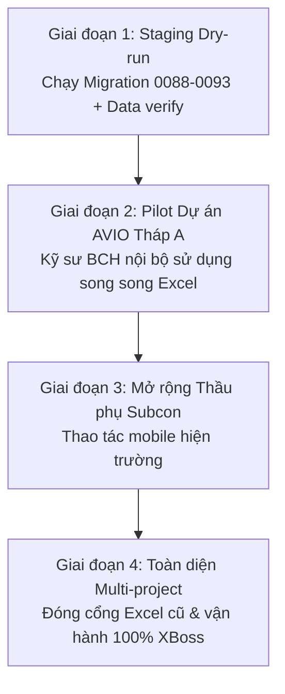

# Kế hoạch UAT & Quy trình Triển khai Production Rollout (C5)

> **Căn cứ đặc tả:** C5 — UAT, Data Reconciliation & Production Rollout (`docs/nang-cap/C5-uat-production-rollout.md`)  
> **Mục tiêu:** Xác nhận nghiệm thu tính năng đa vai trò, đối soát dữ liệu và quy trình phát hành an toàn.

---

## 1. Ma trận Kiểm thử Chấp nhận Người dùng (UAT Matrix theo 7 vai trò)

| Vai trò      | Phạm vi kiểm tra trọng yếu                                                                                                            | Kỳ vọng chấp nhận                                                             |
| ------------ | ------------------------------------------------------------------------------------------------------------------------------------- | ----------------------------------------------------------------------------- |
| **Admin**    | Quản lý User, phân quyền `role_permissions`, Audit log, API Key, Ingest health, Backup/Restore                                        | Toàn quyền kiểm soát, thay đổi quyền có audit trail, xem được metric hệ thống |
| **PM**       | Dashboard KPI tổng hợp, WBS/Tracking, S-Curve, Lookahead, Phê duyệt QA/Nghiệm thu, BOQ/Hợp đồng/VO/IPC, Quản lý Suggestions/Workflows | Dữ liệu tiến độ realtime, quy trình Gate 0 chặt chẽ, không bỏ sót việc trễ    |
| **Engineer** | Mobile PWA, Tick tiến độ theo dimension, Upload ảnh/biên bản hiện trường, Ghi nhật ký thi công, Offline sync                          | Giao diện mobile mượt mà, lưu tạm khi mất mạng và đồng bộ ngay khi có mạng    |
| **Subcon**   | Chỉ xem và thao tác trên Work Package/Task được phân công (`canTouchTask`/`canTouchPackage`)                                          | Không thể xem hoặc can thiệp vào dữ liệu nhà thầu khác hoặc dự án khác        |
| **BCH**      | Xem tiến độ tổng thể, xem báo cáo chi phí/thanh toán (`PAYMENT_VIEW_ROLES`), bình luận                                                | Không có quyền ghi đè nghiệm thu hoặc sửa hợp đồng                            |
| **CĐT**      | Xem dashboard tiến độ, xem báo cáo nghiệm thu hoàn thành                                                                              | Không xem dữ liệu nội bộ đấu thầu/VO nhạy cảm                                 |
| **Viewer**   | Chỉ xem danh mục tiến độ cơ bản                                                                                                       | Bị chặn toàn bộ các API ghi                                                   |

---

## 2. 6 Hành trình Nghiệm thu Trọng yếu (End-to-End Journeys)

1. **Từ Excel đến Dashboard:** Upload file Excel tracking → Preview & đối soát dòng lỗi → Xác nhận import lô (`import_batches`) → Dữ liệu cập nhật ngay trên Dashboard & Tracking sheet.
2. **Tiến độ & Đường cong S-Curve:** Kỹ sư tick hoàn thành trên công trường → Tự động tính toán % cấp Floor/Tower → S-Curve & Lookahead cập nhật.
3. **Mua sắm & Vật tư:** Đề xuất vật tư → Nhập kho → Xuất kho lắp đặt → Đối soát chi phí và xuất hóa đơn.
4. **Kiểm soát Chất lượng & Nghiệm thu:** Tạo yêu cầu nghiệm thu QA → Ký duyệt theo SoD → Kích hoạt bảo hành (Warranty tracking).
5. **Ingest Kỹ thuật từ Agent:** MEPF-Agents gửi đối tượng/quan hệ CAD → Kỹ sư duyệt suggestion trên UI → Tạo Engineering Workflow với Gate 0 → Ký duyệt không phát sinh side effect tự động.
6. **Chuyển đổi Dự án & Cách ly Dữ liệu:** Chuyển đổi cookie `xboss_project` → Toàn bộ truy vấn áp RLS và lọc đúng `project_id`, tuyệt đối không rò rỉ dữ liệu chéo dự án.

---

## 3. Kế hoạch Triển khai Phân tầng (Cohort Rollout Plan)

- **Rollback Plan:**
  - Mỗi migration đều có script rollback tương ứng.
  - Trước khi áp dụng migration trên production: Thực hiện snapshot DB đầy đủ (`pg_dump`).
  - Sử dụng script `npm run audit:verify-dr` để xác nhận dữ liệu sau khi backup/restore.
